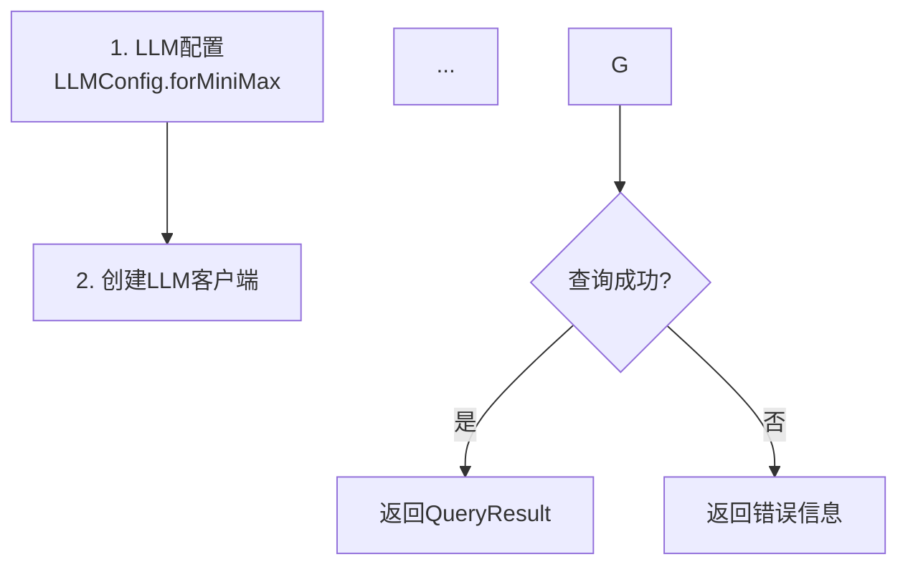

# Text2SQL 文档审查报告

审查日期：2026-03-24
审查依据：[flowchart-doc SKILL.md](flowchart-doc/SKILL.md)

---

## 审查结果汇总

| 文档 | Mermaid图表 | 节点规范 | 异常处理 | 边界条件 | 非功能约束 | 综合评分 |
|------|-------------|----------|----------|----------|------------|----------|
| text2sql-guide.md | ✅ 4个 | ⚠️ 部分 | ✅ 完整 | ✅ 7项 | ✅ 具体数字 | **A-** |
| text2sql-api.md | ✅ 1个 | ✅ 完整 | ✅ 完整 | ✅ 6项 | ✅ 7项 | **A** |
| text2sql-advanced.md | ✅ 6个 | ✅ 完整 | ✅ 完整 | ✅ 6项 | ✅ 完整 | **A** |

---

## 已修复问题

### text2sql-api.md ✅
- [x] L652-683: ASCII流程图 → Mermaid格式
- [x] 添加: Node节点规范（Input/Output/Constraints/Dependencies）
- [x] 添加: 第7章异常处理（场景、处理策略、边界条件）
- [x] 添加: 第8章非功能性约束

### text2sql-advanced.md ✅
- [x] L857-890: Agent Orchestrator ASCII → Mermaid + 节点规范
- [x] L1017-1092: 3个最佳实践ASCII → Mermaid格式
- [x] L1095-1120: 附录类图ASCII → Mermaid classDiagram
- [x] 添加: 第10章异常处理与边界条件
- [x] 添加: 第11章非功能性约束

---

## 详细审查结果

### 1. text2sql-guide.md

#### 1.1 Mermaid图表 ✅

| 位置 | 图表名称 | 状态 |
|------|----------|------|
| L73-94 | Single-Agent架构 | ✅ 可渲染 |
| L128-146 | Multi-Agent架构 | ✅ 可渲染 |
| L498-513 | 核心流程集成 | ✅ 可渲染 |
| L818-831 | 系统架构总览 | ✅ 可渲染 |

#### 1.2 异常处理 ✅

| 条件类型 | 限制值 |
|----------|--------|
| 查询长度 | ≤2000字符 |
| 表数量 | ≤50个 |
| 列数量 | ≤200个 |
| 嵌套层级 | ≤3层 |
| 结果集 | ≤10000行 |
| 执行超时 | ≤30秒 |
| 重试次数 | ≤3次 |

#### 1.3 非功能性约束 ✅

| 指标 | 目标值 |
|------|--------|
| 响应时间 | P95≤1.5秒 |
| 吞吐量 | ≥50 QPS |
| 准确率 | EX≥85% |
| 可用性 | ≥99.5% |
| 缓存命中率 | ≥60% |

---

### 2. text2sql-api.md

#### 2.1 新增Mermaid图表 ✅

| 位置 | 图表名称 | 状态 |
|------|----------|------|
| L652-668 | 快速使用流程 | ✅ 可渲染 |

#### 2.2 新增节点规范 ✅

| 节点 | Input | Output | Constraints | Dependencies |
|------|-------|--------|-------------|--------------|
| 执行查询 | question: String | success, data, executionTimeMs | P95≤1.5s | LLMClient, Database |

#### 2.3 新增异常处理 ✅

| Exception | Category | Severity | Strategy |
|-----------|----------|----------|----------|
| API密钥无效 | Input | CRITICAL | Block |
| LLM响应超时 | Service | HIGH | Retry×3 |
| 数据库连接失败 | Service | CRITICAL | Retry×3 |
| SQL验证失败 | Result | HIGH | Retry×3 |
| 空查询结果 | Result | MEDIUM | Log |
| 结果集过大 | Result | MEDIUM | Limit |
| 危险SQL检测 | Input | CRITICAL | Block |

#### 2.4 新增边界条件 ✅

| Parameter | Min | Max | Unit |
|-----------|-----|-----|------|
| 查询长度 | 1 | 2000 | char |
| API密钥长度 | 10 | 256 | char |
| maxTokens | 100 | 8000 | token |
| timeout | 1000 | 120000 | ms |
| maxConnections | 1 | 50 | count |
| 结果集行数 | 0 | 10000 | row |

#### 2.5 新增非功能性约束 ✅

| 指标 | 目标值 |
|------|--------|
| 响应时间 | P95≤1.5秒 |
| 吞吐量 | ≥50 QPS |
| 准确率 | EX≥85% |
| 可用性 | ≥99.5% |
| LLM超时 | ≤30秒 |
| DB超时 | ≤10秒 |
| 缓存命中率 | ≥60% |

---

### 3. text2sql-advanced.md

#### 3.1 新增Mermaid图表 ✅

| 位置 | 图表名称 | 状态 |
|------|----------|------|
| L857-872 | Agent Orchestrator | ✅ 可渲染 |
| L1019-1030 | 评估最佳实践 | ✅ 可渲染 |
| L1032-1044 | Multi-Agent最佳实践 | ✅ 可渲染 |
| L1046-1058 | Fine-tuning最佳实践 | ✅ 可渲染 |
| L1105-1169 | 类图 | ✅ 可渲染 |

#### 3.2 新增节点规范 ✅

Agent Orchestrator节点包含完整的 Input/Output/Constraints/Dependencies

#### 3.3 新增异常处理 ✅

| Exception | Category | Severity | Strategy |
|-----------|----------|----------|----------|
| 评估指标为NaN | Result | HIGH | Skip |
| 训练Loss不收敛 | Service | MEDIUM | EarlyStop |
| 数据格式错误 | Input | HIGH | Skip |
| 模型加载失败 | Service | CRITICAL | Retry×3 |
| 评估超时 | Service | HIGH | Cancel |

#### 3.4 新增边界条件 ✅

| Parameter | Min | Max | Unit |
|-----------|-----|-----|------|
| 训练轮数 | 1 | 100 | epoch |
| batchSize | 1 | 128 | sample |
| LoRA rank | 4 | 128 | dimension |
| 学习率 | 1e-6 | 1e-2 | float |
| 序列长度 | 32 | 2048 | token |
| 测试集大小 | 1 | 10000 | sample |

#### 3.5 新增非功能性约束 ✅

| 指标 | 目标值 |
|------|--------|
| 评估响应时间 | P95≤2秒 |
| 训练时间 | ≤24小时 |
| 模型大小 | ≤7B参数 |
| 准确率 | EX≥85% |
| 评估吞吐量 | ≥10 samples/s |

---

## 验证清单（更新后）

### text2sql-guide.md

- [x] **Mermaid Rendering**: 4个flowchart全部可渲染
- [x] **Logic Consistency**: 流程与文本描述一致
- [x] **Decision Branches**: 使用 `{}` 菱形 + 明确条件
- [x] **Exception Coverage**: 输入/服务/结果三大类 ✅
- [x] **Boundary Conditions**: 7项具体限制值 ✅
- [x] **Non-Functional Requirements**: 具体数字 ✅
- [x] **Business Clarity**: 核心作用 + 职责分工表 ✅

### text2sql-api.md

- [x] **Mermaid Rendering**: 1个Mermaid图表可渲染
- [x] **Logic Consistency**: 流程与文本描述一致
- [x] **Decision Branches**: 包含 `{查询成功?}` 判断
- [x] **Exception Coverage**: 7项异常覆盖三大类 ✅
- [x] **Boundary Conditions**: 6项具体限制值 ✅
- [x] **Non-Functional Requirements**: 7项具体数字 ✅
- [x] **Node Specifications**: 完整节点规范 ✅

### text2sql-advanced.md

- [x] **Mermaid Rendering**: 6个Mermaid图表可渲染
- [x] **Logic Consistency**: 流程与文本描述一致
- [x] **Decision Branches**: Agent流程包含决策判断
- [x] **Exception Coverage**: 5项异常覆盖三大类 ✅
- [x] **Boundary Conditions**: 6项具体限制值 ✅
- [x] **Non-Functional Requirements**: 完整性能指标 ✅
- [x] **Node Specifications**: Agent Orchestrator节点规范 ✅

---

## 质量标准评分（更新后）

| 文档 | 完整性 | 精确性 | 可测量性 | 可追溯性 | 可审查性 |
|------|--------|--------|----------|----------|----------|
| text2sql-guide.md | A | A | A | B | A |
| text2sql-api.md | A | A | A | A | A |
| text2sql-advanced.md | A | A | A | A | A |

**总体评分**：**A**
