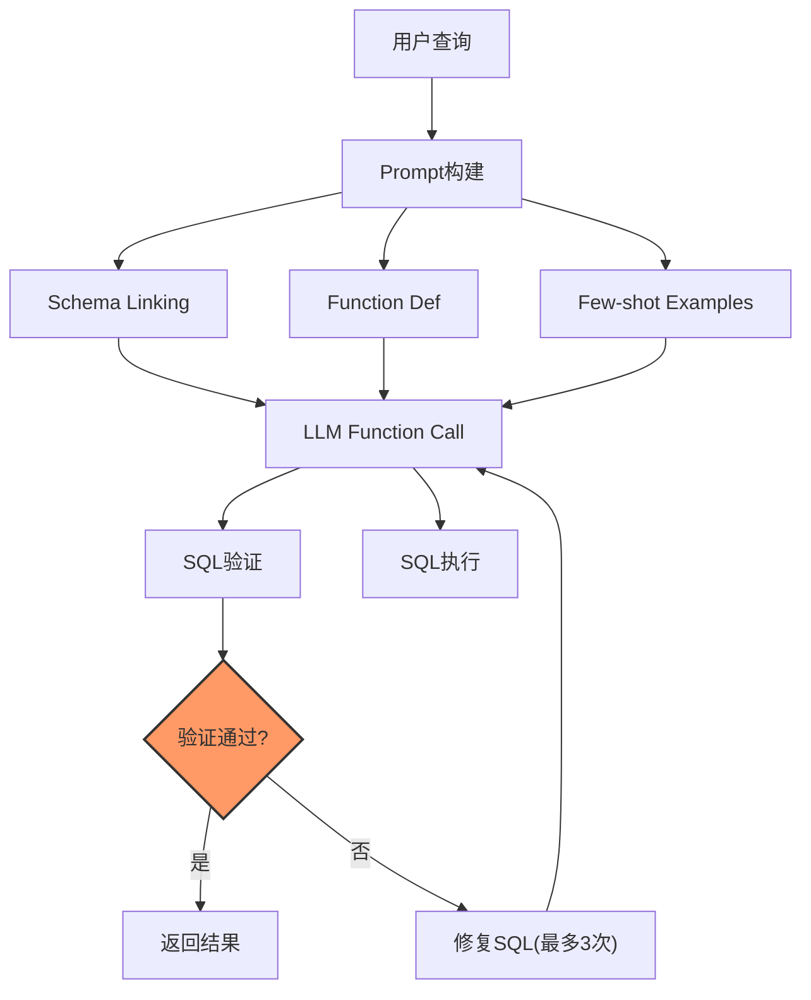
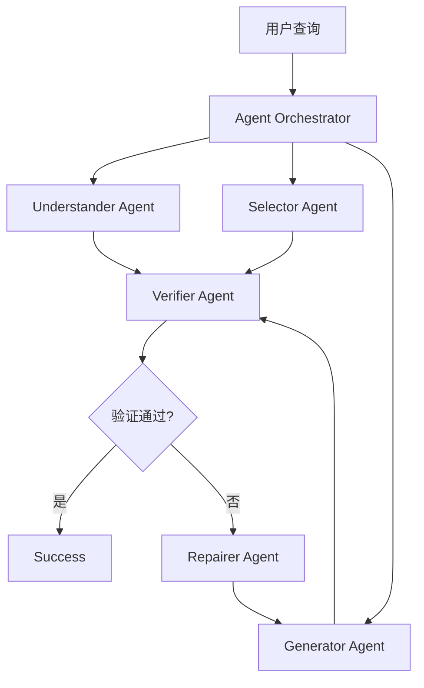
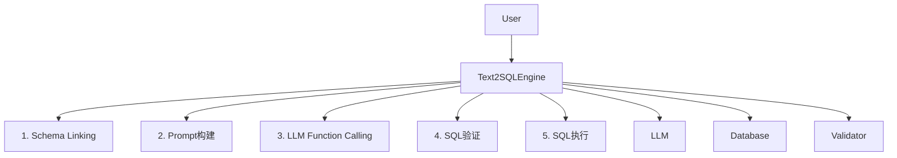

# Text2SQL 实现指南

## 文档索引

| 文档                                           | 说明                               |
| -------------------------------------------- | -------------------------------- |
| [text2sql-guide.md](text2sql-guide.md)       | 本文档，核心指南                         |
| [text2sql-api.md](text2sql-api.md)           | API参考                            |
| [text2sql-advanced.md](text2sql-advanced.md) | 高级特性 |

### 详细文档依赖

| 模块 | 详细文档目录 | 说明 |
|------|-------------|------|
| **Schema Linking** | [docs/schema-linking/](docs/schema-linking/) | 模式对齐详细实现 |
| **SQL Validation** | [docs/sql-validation/](docs/sql-validation/) | SQL语法检测详细实现 |
| **SQL Optimization** | [docs/sql-optimization/](docs/sql-optimization/) | 查询效率优化详细实现 |

---

## 1. 概述

### 1.1 核心作用

Text2SQL系统将自然语言查询转换为SQL语句，基于LLM大模型实现，包含语义理解、模式对齐、SQL生成、语法检测、效率优化五大核心处理流程。

### 1.2 核心处理流程

| 流程          | 说明            | 详细说明                       |
| ----------- | ------------- | -------------------------- |
| **语义理解**    | 处理自然语言歧义      | [3.1 语义理解](#31-语义理解)       |
| **模式对齐**    | 自然语言→Schema映射 | [3.2 模式对齐](#32-模式对齐)       |
| **SQL语法检测** | 确保SQL语法正确     | [3.3 SQL语法检测](#33-sql语法检测) |
| **查询效率优化**  | 避免低效SQL       | [3.4 查询效率优化](#34-查询效率优化)   |

### 1.3 核心特性

| 特性               | 说明                            |
| ---------------- | ----------------------------- |
| 多数据库支持           | MySQL、PostgreSQL、MongoDB      |
| 多LLM支持           | MiniMax、通义千问、OpenAI、本地模型      |
| Function Calling | 通过LLM的Function Calling机制生成SQL |
| 安全验证             | 多层SQL安全检查和执行验证                |
| 评估体系             | EX/EM/VES指标评估                 |

### 1.4 评估指标

| 指标      | 说明     | 计算公式          |
| ------- | ------ | ------------- |
| **EX**  | 执行准确率  | 预测结果==标准结果的比例 |
| **EM**  | 精确匹配率  | SQL精确匹配的比例    |
| **VES** | 有效效率分数 | EX × 效率分数     |

***

## 2. 架构设计

### 2.1 两种运行模式

**核心作用**：定义Text2SQL系统的两种运行模式，根据查询复杂度选择。

| 模式                | 适用场景 | 复杂度 | 响应时间目标 |
| ----------------- | ---- | --- | ------ |
| **单Agent模式**      | 简单查询 | 低   | P95≤1秒 |
| **Multi-Agent模式** | 复杂查询 | 高   | P95≤3秒 |

#### 执行策略选择

| 场景         | 模式选择              | 说明         |
| ---------- | ----------------- | ---------- |
| 单表、无聚合     | 单Agent模式          | P95响应时间≤1秒 |
| 多表连接、简单聚合  | 单Agent + Few-shot | 添加示例提升准确性  |
| 嵌套子查询、多步逻辑 | Multi-Agent模式     | 协作处理复杂任务   |

***

### 2.2 单Agent模式架构

**核心作用**：单次LLM调用完成SQL生成，适合简单到中等复杂度查询。



#### 执行步骤

```
1. Schema Linking
   • 输入：数据库连接
   • 输出：相关表和列
         ↓
2. Prompt构建
   • 输入：Schema + Function定义 + Few-shot
   • 输出：完整Prompt
         ↓
3. LLM Function Calling
   • 输入：Prompt
   • 输出：生成的SQL
         ↓
4. SQL验证
   • 输入：SQL
   • 输出：验证结果
         ↓
5. 条件分支
   • 验证通过？否 → 修复SQL（最多3次）
   • 验证通过？是 → 执行
         ↓
6. 返回结果
```

***

### 2.3 Multi-Agent模式架构

**核心作用**：协调多个专业Agent协作处理复杂Text2SQL任务。



#### Agent职责分工

| Agent            | 职责         | 输入        | 输出        |
| ---------------- | ---------- | --------- | --------- |
| **Understander** | 理解查询意图     | 用户问题      | 结构化意图描述   |
| **Selector**     | 选择相关Schema | 意图描述      | 相关的表和列    |
| **Generator**    | 生成SQL      | Schema+意图 | SQL语句     |
| **Verifier**     | 验证SQL正确性   | SQL       | 验证结果+问题列表 |
| **Repairer**     | 修复错误SQL    | 错误+意图     | 修复后的SQL   |

#### 执行步骤

```
1. UNDERSTANDER Agent
   • 输入：用户问题
   • 输出：结构化意图描述
         ↓
2. SELECTOR Agent
   • 输入：意图描述
   • 输出：相关的表和列
         ↓
3. GENERATOR Agent
   • 输入：Schema + 意图
   • 输出：SQL语句
         ↓
4. VERIFIER Agent
   • 输入：SQL
   • 输出：验证结果
         ↓
5. 条件分支
   • 验证通过？否 → REPAIRER Agent
   • 验证通过？是 → 返回AgentResult
         ↓
6. REPAIRER Agent
   • 输入：错误信息 + 意图
   • 输出：修复后的SQL
   • 说明：最多3次修复循环
         ↓
7. 返回AgentResult
```

#### Multi-Agent优势

| 优势     | 说明                      |
| ------ | ----------------------- |
| 复杂处理能力 | 分解任务，降低LLM单次处理难度        |
| 可解释性强  | 每步操作可追溯，便于调试            |
| 自我纠正   | VERIFIER失败时自动调用REPAIRER |
| 可扩展性强  | 可添加自定义Agent             |

***

### 2.4 核心组件

**核心作用**：定义Text2SQL系统的核心组件及其职责。

| 组件                       | 职责                     | 相关文档                                            |
| ------------------------ | ---------------------- | ----------------------------------------------- |
| **LLMClient**            | LLM调用和Function Calling | [text2sql-api.md](text2sql-api.md#L1)           |
| **DatabaseOperations**   | 数据库操作抽象                | [text2sql-api.md](text2sql-api.md#L1)           |
| **SQLSecurityValidator** | SQL安全验证                | [text2sql-api.md](text2sql-api.md#L1)           |
| **AgentOrchestrator**    | Agent协调管理              | [text2sql-advanced.md](text2sql-advanced.md#L1) |
| **Text2SQLEngine**       | 核心引擎                   | [text2sql-api.md](text2sql-api.md#L1)           |

***

## 3. 核心处理流程

### 3.1 语义理解

**核心作用**：处理自然语言中的歧义和模糊表达，确保准确理解用户查询意图。

#### 歧义类型

| 歧义类型 | 示例 | 说明 | 详细文档 | 对应处理 |
|----------|------|------|----------|----------|
| **时间歧义** | "最新数据" | 可能指时间最新或ID最大 | [intent-resolution.md](docs/intent-resolution/intent-resolution.md) | `IntentResolver.resolveTimeAmbiguity()` |
| **数量歧义** | "大部分用户" | 具体比例不明确 | [intent-resolution.md](docs/intent-resolution/intent-resolution.md) | `IntentResolver.resolveQuantityAmbiguity()` |
| **排序歧义** | "最好的产品" | 可能指评分最高、销量最高等 | [intent-resolution.md](docs/intent-resolution/intent-resolution.md) | `IntentResolver.resolveRankingAmbiguity()` |
| **范围歧义** | "近期订单" | 具体时间范围不明确 | [intent-resolution.md](docs/intent-resolution/intent-resolution.md) | `IntentResolver.resolveRangeAmbiguity()` |

#### 歧义处理策略

```
1. 歧义检测
   • 分析问题中的模糊词汇
   • 识别可能的歧义类型
         ↓
2. 意图分类
   • 时间意图：创建时间、更新时间
   • 数量意图：总数、最大、最小、平均
   • 排序意图：升序、降序、TopN
   • 范围意图：最近、全部、筛选范围
         ↓
3. 消歧策略
   • 上下文推断：利用对话历史
   • 默认解释：采用最合理的默认
   • 用户确认：提供选项让用户选择
         ↓
4. 意图输出
   • 结构化意图描述
   • 消歧后的明确含义
   • 置信度评分
```

#### 执行步骤

```
1. 歧义词识别
   • 检测"最新"、"最高"、"大部分"等模糊词
   • 标记歧义位置和类型
         ↓
2. 上下文分析
   • 检查对话历史
   • 利用上下文推断含义
         ↓
3. 默认消歧
   • 时间最新 → ORDER BY time DESC
   • 数量最多 → ORDER BY count DESC LIMIT
   • 采用最合理的默认解释
         ↓
4. 用户确认（可选）
   • 生成选项让用户选择
   • "您是指按创建时间还是更新时间排序？"
         ↓
5. 输出结构化意图
   • 明确的查询意图
   • 消歧后的具体条件
```

***

### 3.2 模式对齐

**核心作用**：将自然语言中的提及正确映射到数据库表结构，确保Schema引用准确。

#### 对齐方法

| 方法         | 说明                       | 详细文档                                                                                   |
| ---------- | ------------------------ | -------------------------------------------------------------------------------------- |
| **字符串相似度** | Levenshtein距离、Jaccard相似度 | [docs/schema-linking/string-match.md](docs/schema-linking/string-match.md)             |
| **语义嵌入**   | Sentence-BERT、USE等       | [docs/schema-linking/semantic-embed.md](docs/schema-linking/semantic-embed.md)         |
| **联合学习**   | 同时学习表结构和NL表示             | [docs/schema-linking/joint-learning.md](docs/schema-linking/joint-learning.md)         |
| **关系推断**   | 外键关系分析、JOIN路径            | [docs/schema-linking/relation-inference.md](docs/schema-linking/relation-inference.md) |

#### 对齐策略

```
1. 文本预处理
   • 分词和词性标注
   • 实体识别（表名、列名）
   • 同义词扩展
         ↓
2. 字符串匹配
   • 表名直接匹配
   • 列名直接匹配
   • 模糊匹配（Levenshtein）
         ↓
3. 语义匹配
   • 生成文本嵌入向量
   • 计算与Schema的相似度
   • 阈值过滤
         ↓
4. 关系推断
   • 外键关系分析
   • 表连接路径推断
   • JOIN条件生成
         ↓
5. 对齐验证
   • 候选集排序
   • 置信度评估
   • 歧义检测
```

#### 执行步骤

```
1. 关键词提取
   • 从问题中提取关键实体
   • "客户" → customer表
   • "订单金额" → order.amount列
         ↓
2. 字符串相似度匹配
   • 计算编辑距离
   • LevenshteinDistance("用户", "users") = 1
   • 设置阈值 > 0.8 保留
         ↓
3. 语义嵌入匹配
   • 使用Sentence-BERT编码
   • Embedding("客户") vs Embedding("customer")
   • 计算余弦相似度
         ↓
4. 联合排序
   • 综合字符串分数 + 语义分数
   • 最终排序候选Schema元素
         ↓
5. 外键关系推断
   • 分析表之间的外键
   • 自动推断JOIN路径
   • 生成JOIN条件
```

***

### 3.3 SQL语法检测

**核心作用**：确保生成的SQL符合目标数据库的语法规范，特别是复杂查询涉及多表连接、子查询、聚合函数等。

详细实现见 [SQL Validation 文档索引](../docs/sql-validation/README.md)：

| 文档 | 检测层次 | 说明 | 详细文档 |
|------|---------|------|----------|
| [词法检测](../docs/sql-validation/lexical-validation.md) | Token级别验证 | 关键字、标识符正确性 | [lexical-validation.md](../docs/sql-validation/lexical-validation.md) |
| [句法检测](../docs/sql-validation/syntactic-validation.md) | 结构级别验证 | 子句完整、括号匹配 | [syntactic-validation.md](../docs/sql-validation/syntactic-validation.md) |
| [语义检测](../docs/sql-validation/semantic-validation.md) | 含义级别验证 | 表/列存在性、类型兼容 | [semantic-validation.md](../docs/sql-validation/semantic-validation.md) |
| [执行检测](../docs/sql-validation/execution-validation.md) | 运行级别验证 | 执行计划、性能评估 | [execution-validation.md](../docs/sql-validation/execution-validation.md) |

***

### 3.4 查询效率优化

**核心作用**：避免生成性能低下的SQL，如缺少索引的全表扫描、不必要的嵌套查询等。

#### 优化策略

| 策略         | 说明               | 详细文档                                                                                                 |
| ---------- | ---------------- | ---------------------------------------------------------------------------------------------------- |
| **提示词嵌入**  | 在Prompt中嵌入性能最佳实践 | [docs/sql-optimization/prompt-optimization.md](docs/sql-optimization/prompt-optimization.md)         |
| **后优化处理**  | 对生成的SQL进行重写和优化   | [docs/sql-optimization/sql-rewriter.md](docs/sql-optimization/sql-rewriter.md)                       |
| **执行计划反馈** | 与数据库优化器结合        | [docs/sql-optimization/execution-plan-analyzer.md](docs/sql-optimization/execution-plan-analyzer.md) |

#### 优化流程

```
1. 性能规则检查
   • 全表扫描检测
   • 缺少WHERE条件检测
   • 不必要子查询检测
         ↓
2. Prompt优化提示
   • 生成SQL时考虑性能
   • 添加索引提示
   • 避免SELECT *
         ↓
3. SQL后优化
   • 简化嵌套查询
   • 合并重复表引用
   • 优化WHERE条件顺序
         ↓
4. 执行计划分析
   • EXPLAIN分析
   • 全表扫描标记
   • 建议添加索引
         ↓
5. 优化反馈
   • 返回优化建议
   • 自动重写（可选）
   • 性能评分
```

#### 执行步骤

```
1. 性能规则检查
   • 检测SELECT *
   • 检测缺少WHERE
   • 检测笛卡尔积风险
         ↓
2. Prompt优化提示
   • 在System Prompt中添加：
   • "尽量指定具体列名"
   • "使用合理的WHERE条件"
   • "避免全表扫描"
         ↓
3. SQL后优化
   • 展开SELECT *
   • 简化子查询
   • 优化JOIN顺序
         ↓
4. 执行计划分析
   • 执行EXPLAIN
   • 分析扫描方式
   • 计算预估行数
         ↓
5. 优化反馈
   • 标记性能问题
   • 提供优化建议
   • 可选自动重写
```

***

### 3.5 核心流程集成


#### 各流程依赖关系

| 流程    | 前置依赖        | 后置输出      |
| ----- | ----------- | --------- |
| 语义理解  | 用户问题        | 结构化意图     |
| 模式对齐  | 意图 + Schema | 对齐的Schema |
| SQL生成 | 对齐结果        | SQL语句     |
| 语法检测  | SQL         | 检测结果      |
| 效率优化  | SQL         | 优化SQL     |

***

## 4. Prompt工程

### 4.1 Prompt模板

**核心作用**：提供标准化的Prompt模板，提升SQL生成准确性。

#### 模板类型

| 模板             | 适用场景  | 说明                 |
| -------------- | ----- | ------------------ |
| **基础模板**       | 简单查询  | 基础Schema描述         |
| **Few-shot模板** | 中等复杂度 | 添加示例提升准确性          |
| **CoT模板**      | 复杂查询  | Chain-of-Thought引导 |

#### 模板构成

```
1. System Prompt
   • 角色定义：SQL专家
   • 任务说明：自然语言转SQL
   • 约束条件：只生成SELECT
         ↓
2. Schema Description
   • 表名和注释
   • 列名、类型、约束
   • 主键、外键关系
         ↓
3. Few-shot Examples（可选）
   • 问答对示例
   • 覆盖常见查询模式
         ↓
4. User Question
   • 用户的自然语言查询
```

#### 执行步骤

```
1. 定义System Prompt
   • 设置角色：你是SQL专家
   • 说明任务：自然语言转SQL
   • 添加约束：只生成SELECT语句
         ↓
2. 构建Schema描述
   • 获取表名和注释
   • 列出列名、类型、约束
   • 标注主键、外键
         ↓
3. 添加Few-shot示例（可选）
   • 选择代表性问答对
   • 确保示例覆盖查询模式
         ↓
4. 拼接完整Prompt
   • System + Schema + Examples + Question
         ↓
5. 调用LLM生成SQL
```

***

### 4.2 Schema描述模板

**核心作用**：标准化Schema描述，确保LLM准确理解数据库结构。

#### Schema描述格式

```
表名：table_name (表注释)
字段：
  - column_name (type) [PK] [FK] 字段注释
  - column_name (type) 字段注释

示例：
表名：users (用户表)
字段：
  - id (INT) [PK] 用户ID
  - name (VARCHAR) 用户名
  - city (VARCHAR) 所在城市
```

#### 执行步骤

```
1. 获取所有表名
   • SHOW TABLES (MySQL)
   • 遍历每个表
         ↓
2. 获取表注释
   • TABLE_COMMENT (MySQL)
   • 添加表级别的业务说明
         ↓
3. 获取列信息
   • 列名、数据类型
   • 主键、是否可空
   • 列注释
         ↓
4. 获取外键关系
   • FOREIGN_KEY_INFO
   • 建立表间关联
         ↓
5. 格式化输出
   • 按标准模板拼接
```

***

### 4.3 温度参数选择

**核心作用**：根据查询类型选择合适的温度参数，平衡准确性和多样性。

| 查询类型 | 温度范围    | 说明        | 使用场景       |
| ---- | ------- | --------- | ---------- |
| 简单查询 | 0.0-0.1 | 确定性高      | 单表、无聚合     |
| 标准查询 | 0.1-0.3 | 平衡准确性和多样性 | 多表连接、简单聚合  |
| 复杂查询 | 0.3-0.5 | 需要更多推理    | 嵌套子查询、多步逻辑 |

***

## 5. Schema Linking策略

### 5.1 Schema Linking定义

**核心作用**：从数据库Schema中智能选择与查询相关的表和列，减少LLM干扰。

### 5.2 匹配策略

| 策略   | 说明           | 优先级 |
| ---- | ------------ | --- |
| 表名匹配 | 问题中包含表名      | 高   |
| 注释匹配 | 问题与表/列注释语义匹配 | 中   |
| 列名匹配 | 问题中包含列名      | 高   |
| 关系匹配 | 基于外键关系推断     | 中   |

### 5.3 执行步骤

```
1. 关键词提取
   • 分词处理
   • 移除停用词
   • 提取核心名词
         ↓
2. 表名匹配
   • 遍历所有表
   • 检查表名是否在问题中
         ↓
3. 注释匹配
   • 比较问题与表/列注释
   • 语义相似度计算
         ↓
4. 列名匹配
   • 遍历所有列
   • 检查列名是否在问题中
         ↓
5. 关系推断
   • 基于外键建立关联
   • 自动包含相关表
         ↓
6. 结果筛选
   • 优先选择直接匹配
   • 包含间接关联表
```

***

### 5.4 匹配优先级

| 匹配类型 | 优先级 | 说明        |
| ---- | --- | --------- |
| 精确匹配 | 最高  | 表名/列名完全匹配 |
| 语义匹配 | 高   | 注释/同义词匹配  |
| 关系匹配 | 中   | 外键关联的表    |
| 默认包含 | 最低  | 未匹配时包含所有表 |

***

## 6. 错误处理

### 6.1 错误分类

**核心作用**：定义错误分类体系，便于问题定位和用户反馈。

| 错误类型         | 严重级别     | 处理策略          |
| ------------ | -------- | ------------- |
| **语法错误**     | CRITICAL | 返回友好提示，建议简化问题 |
| **Schema错误** | HIGH     | 列出可用的表和列供选择   |
| **执行超时**     | MEDIUM   | 设置超时限制，返回超时错误 |
| **空结果**      | LOW      | 提示检查查询条件      |

### 6.2 处理策略

```
1. 捕获错误
   • SQL执行异常
   • 超时异常
   • 验证失败
         ↓
2. 错误分类
   • 解析错误类型
   • 确定严重级别
         ↓
3. 生成用户友好的错误信息
   • 简化错误描述
   • 提供修复建议
         ↓
4. 记录错误日志
   • 错误类型统计
   • 用于系统优化
         ↓
5. 返回给用户
   • 友好的错误提示
   • 可操作的建议
```

#### 边界条件

| 条件类型     | 限制值     | 说明          |
| -------- | ------- | ----------- |
| **查询长度** | ≤2000字符 | 超出则提示拆分查询   |
| **表数量**  | ≤50个    | 单次查询涉及的最大表数 |
| **列数量**  | ≤200个   | 单表最大列数限制    |
| **嵌套层级** | ≤3层     | 子查询最大嵌套深度   |
| **结果集**  | ≤10000行 | 单次查询返回最大行数  |
| **执行超时** | ≤30秒    | SQL执行超时限制   |
| **重试次数** | ≤3次     | 验证失败最大重试次数  |

***

## 7. 最佳实践

### 7.1 核心要点

| 要点                 | 说明              |
| ------------------ | --------------- |
| **架构清晰**           | 分层设计，职责明确       |
| **安全第一**           | 多层验证，防止SQL注入    |
| **Prompt关键**       | 精心设计Prompt提升准确性 |
| **Schema Linking** | 精准选择相关表减少干扰     |
| **评估驱动**           | 使用EX/EM/VES持续优化 |

### 7.2 性能优化

```
1. Schema缓存
   • 缓存频繁访问的Schema
   • TTL设置：≤5分钟自动过期
         ↓
2. LLM响应缓存
   • 缓存相同查询的响应
   • 使用查询哈希作为key
   • 缓存命中率目标：≥60%
         ↓
3. 异步执行
   • 非关键路径异步处理
   • P99响应时间：≤2秒
         ↓
4. 连接池
   • 使用数据库连接池
   • 最大连接数：≤20
   • 空闲超时：≤30秒
         ↓
5. 并行处理
   • 多个查询并行执行
   • 最大并发：≤10
```

### 7.3 常见问题与解决方案

| 问题         | 原因                 | 解决方案                  |
| ---------- | ------------------ | --------------------- |
| SQL生成不准确   | Prompt不够清晰         | 优化Prompt，添加Few-shot示例 |
| Schema匹配错误 | Schema Linking不够智能 | 增强匹配策略，使用语义匹配         |
| 执行速度慢      | SQL效率低             | 优化SQL，添加索引            |
| 安全性问题      | 验证不够全面             | 启用所有验证规则              |
| 空结果        | 查询条件过严             | 放宽条件或检查数据             |

***

## 8. 快速使用流程

### 8.1 系统架构总览



### 8.2 完整使用流程

```
1. 配置系统
   ├── LLM配置（MiniMax/通义千问）
   ├── 数据库配置（MySQL/PostgreSQL）
   └── 验证器配置（SQL安全规则）
         ↓
2. 创建引擎
   ├── Text2SQLEngine.builder()
   ├── 设置LLM客户端
   ├── 设置数据库操作
   └── 设置验证器
         ↓
3. 执行查询
   ├── engine.execute("自然语言查询")
   ├── 获取QueryResult
   └── 处理返回结果
         ↓
4. 结果处理
   ├── 检查success标志
   ├── 获取data结果
   └── 处理错误信息


