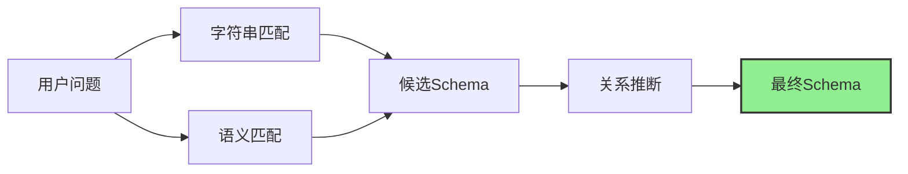

# Schema Linking 文档索引

本目录包含 Schema Linking 各方法的详细实现文档。

## 文档列表

| 文档 | 方法 | 说明 |
|------|------|------|
| [string-match.md](string-match.md) | 字符串相似度匹配 | Levenshtein、Jaccard、子串匹配 |
| [semantic-embed.md](semantic-embed.md) | 语义嵌入匹配 | SBERT、USE、BGE |
| [joint-learning.md](joint-learning.md) | 联合学习方法 | RATSQL、GNN、对比学习 |
| [relation-inference.md](relation-inference.md) | 关系推断 | 外键推断、JOIN路径生成 |

## 方法选择指南

| 场景 | 推荐方法 | 原因 |
|------|----------|------|
| 简单表名单匹配 | 字符串相似度 | 速度快，准确率高 |
| 语义相似匹配 | 语义嵌入 | 支持同义词，语义理解 |
| 复杂映射关系 | 联合学习 | 端到端，准确性高 |
| 跨表JOIN推断 | 关系推断 | 自动发现JOIN路径 |

## 组合策略

推荐组合：
1. **字符串匹配 + 语义匹配** = 候选Schema
2. **关系推断** = JOIN路径
3. **置信度排序** = 最终输出
