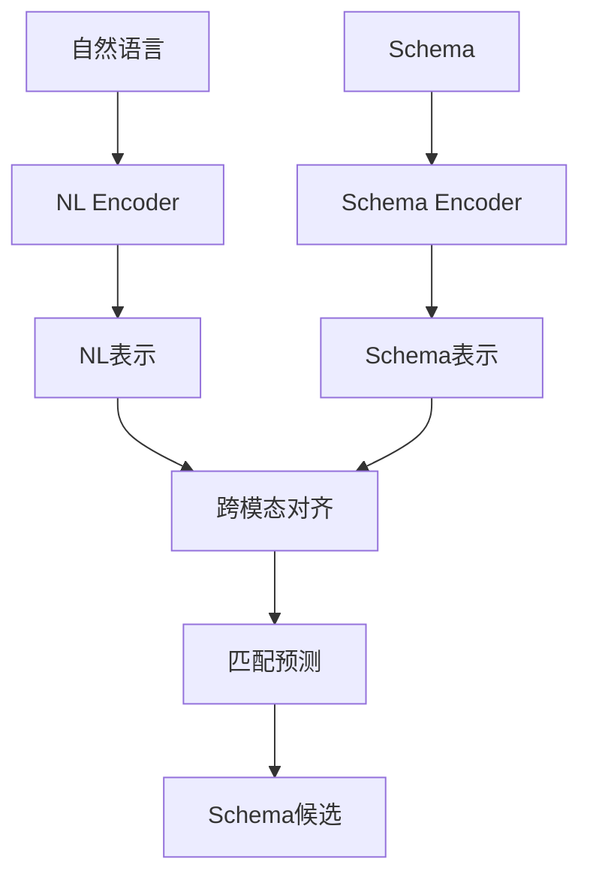

# Schema Linking: 联合学习方法

## 概述

联合学习通过同时学习自然语言表示和数据库Schema结构，学习两者之间的映射关系，实现端到端的Schema Linking。



---

## 方法分类

### 1. 跨模态预训练

#### RATSQL架构

**核心思想**：通过关系感知的自注意力机制学习表结构和自然语言的联合表示。

**Java接口**：
```java
public interface JointEncoder {
    
    JointRepresentation encode(String question, TableSchema schema);
    
    List<SchemaLink> predict(String question, List<TableSchema> schemas);
}
```

**实现类**：
```java
public class RATSQLEncoder implements JointEncoder {
    
    private final int hiddenSize;
    private final int numHeads;
    private final int numLayers;
    private final RelationAwareAttention attention;
    
    public RATSQLEncoder(int hiddenSize, int numHeads, int numLayers) {
        this.hiddenSize = hiddenSize;
        this.numHeads = numHeads;
        this.numLayers = numLayers;
        this.attention = new RelationAwareAttention(hiddenSize, numHeads);
    }
    
    @Override
    public JointRepresentation encode(String question, TableSchema schema) {
        float[] questionTokens = tokenize(question);
        float[][] schemaTokens = tokenizeSchema(schema);
        int[][] relations = buildRelationGraph(question.length(), schemaTokens.length);
        
        float[][] encoded = new float[questionTokens.length][hiddenSize];
        
        for (int layer = 0; layer < numLayers; layer++) {
            encoded = attention.forward(encoded, schemaTokens, relations);
        }
        
        return new JointRepresentation(encoded, schemaTokens);
    }
    
    private int[][] buildRelationGraph(int questionLen, int schemaLen) {
        int totalLen = questionLen + schemaLen;
        int[][] relations = new int[totalLen][totalLen];
        
        for (int i = 0; i < questionLen; i++) {
            for (int j = questionLen; j < totalLen; j++) {
                relations[i][j] = RelationType.QUESTION_TO_SCHEMA.ordinal();
                relations[j][i] = RelationType.SCHEMA_TO_QUESTION.ordinal();
            }
        }
        
        return relations;
    }
    
    @Override
    public List<SchemaLink> predict(String question, List<TableSchema> schemas) {
        List<SchemaLink> results = new ArrayList<>();
        
        for (TableSchema schema : schemas) {
            JointRepresentation rep = encode(question, schema);
            float score = computeMatchScore(rep);
            
            if (score > 0.5f) {
                results.add(new SchemaLink(schema.getTableName(), score));
            }
        }
        
        results.sort((a, b) -> Float.compare(b.getScore(), a.getScore()));
        return results;
    }
    
    private float computeMatchScore(JointRepresentation rep) {
        float[] questionRep = averagePooling(rep.getQuestionEncoding());
        float[] schemaRep = averagePooling(rep.getSchemaEncoding());
        
        return CosineSimilarity.calculate(questionRep, schemaRep);
    }
    
    private float[] averagePooling(float[][] hidden) {
        float[] pooled = new float[hiddenSize];
        for (float[] row : hidden) {
            for (int i = 0; i < hiddenSize; i++) {
                pooled[i] += row[i];
            }
        }
        int len = hidden.length;
        for (int i = 0; i < hiddenSize; i++) {
            pooled[i] /= len;
        }
        return pooled;
    }
    
    public enum RelationType {
        QUESTION_TO_SCHEMA,
        SCHEMA_TO_QUESTION,
        WITHIN_QUESTION,
        WITHIN_SCHEMA
    }
    
    public static class SchemaLink {
        private final String tableName;
        private final float score;
        
        public SchemaLink(String tableName, float score) {
            this.tableName = tableName;
            this.score = score;
        }
        
        public String getTableName() { return tableName; }
        public float getScore() { return score; }
    }
}
```

---

### 2. 对比学习方法

#### SC-PLM实现

**核心思想**：通过对比学习对齐问题表示和Schema表示。

**训练目标**：
```
L = -log exp(sim(q, s+)) / Σ exp(sim(q, s-))
```

**Java实现**：
```java
public class ContrastiveSchemaLinker {
    
    private final SemanticEncoder encoder;
    private final float temperature;
    private final float margin;
    
    public ContrastiveSchemaLinker(SemanticEncoder encoder, 
                                   float temperature, 
                                   float margin) {
        this.encoder = encoder;
        this.temperature = temperature;
        this.margin = margin;
    }
    
    public float computeLoss(String question, 
                             String positiveSchema, 
                             List<String> negativeSchemas) {
        float[] q = encoder.encode(question);
        float[] p = encoder.encode(positiveSchema);
        
        float posSim = dotProduct(q, p) / temperature;
        
        float sumExp = (float) Math.exp(posSim);
        for (String negSchema : negativeSchemas) {
            float[] n = encoder.encode(negSchema);
            float negSim = dotProduct(q, n) / temperature;
            sumExp += Math.exp(negSim);
        }
        
        return (float) -Math.log(Math.exp(posSim) / sumExp);
    }
    
    public float tripletLoss(String anchor, String positive, String negative) {
        float[] a = encoder.encode(anchor);
        float[] p = encoder.encode(positive);
        float[] n = encoder.encode(negative);
        
        float posDist = euclideanDistance(a, p);
        float negDist = euclideanDistance(a, n);
        
        return Math.max(0, posDist - negDist + margin);
    }
    
    public List<SchemaLink> predict(String question, List<String> schemas) {
        float[] q = encoder.encode(question);
        
        List<SchemaLink> results = new ArrayList<>();
        for (String schema : schemas) {
            float[] s = encoder.encode(schema);
            float sim = CosineSimilarity.calculate(q, s);
            results.add(new SchemaLink(schema, sim));
        }
        
        results.sort((a, b) -> Float.compare(b.getScore(), a.getScore()));
        return results;
    }
    
    private float dotProduct(float[] a, float[] b) {
        float sum = 0;
        for (int i = 0; i < a.length; i++) {
            sum += a[i] * b[i];
        }
        return sum;
    }
    
    private float euclideanDistance(float[] a, float[] b) {
        float sum = 0;
        for (int i = 0; i < a.length; i++) {
            float diff = a[i] - b[i];
            sum += diff * diff;
        }
        return (float) Math.sqrt(sum);
    }
    
    public static class SchemaLink {
        private final String schema;
        private final float score;
        
        public SchemaLink(String schema, float score) {
            this.schema = schema;
            this.score = score;
        }
        
        public String getSchema() { return schema; }
        public float getScore() { return score; }
    }
}
```

---

### 3. 多任务学习方法

#### MWP实现

**任务设计**：
| 任务 | 损失权重 | 说明 |
|------|----------|------|
| 表预测 | 0.3 | 预测相关表 |
| 列预测 | 0.5 | 预测相关列 |
| 关系预测 | 0.2 | 预测JOIN关系 |

**Java实现**：
```java
public class MultiTaskSchemaLinker {
    
    private final SemanticEncoder encoder;
    private final Map<TaskType, Float> taskWeights;
    
    public MultiTaskSchemaLinker(SemanticEncoder encoder, 
                                 Map<TaskType, Float> taskWeights) {
        this.encoder = encoder;
        this.taskWeights = taskWeights;
    }
    
    public enum TaskType {
        TABLE_PREDICTION,
        COLUMN_PREDICTION,
        RELATION_PREDICTION
    }
    
    public MultiTaskOutput forward(String question, TableSchema schema) {
        float[] questionRep = encoder.encode(question);
        float[] schemaRep = encoder.encode(schema.toString());
        
        float[] concatRep = concatenate(questionRep, schemaRep);
        
        float[] tableLogits = tableHead(concatRep);
        float[] columnLogits = columnHead(concatRep);
        float[] relationLogits = relationHead(concatRep);
        
        return new MultiTaskOutput(tableLogits, columnLogits, relationLogits);
    }
    
    private float[] tableHead(float[] input) {
        return softmax(linear(input, Config.NUM_TABLES));
    }
    
    private float[] columnHead(float[] input) {
        return softmax(linear(input, Config.NUM_COLUMNS));
    }
    
    private float[] relationHead(float[] input) {
        return softmax(linear(input, Config.NUM_RELATIONS));
    }
    
    private float[] linear(float[] input, int outputSize) {
        float[] output = new float[outputSize];
        for (int i = 0; i < outputSize; i++) {
            for (int j = 0; j < input.length; j++) {
                output[i] += input[j] * getWeight(j, i);
            }
            output[i] += getBias(i);
        }
        return output;
    }
    
    private float[] softmax(float[] logits) {
        float maxLogit = Float.MIN_VALUE;
        for (float logit : logits) {
            maxLogit = Math.max(maxLogit, logit);
        }
        
        float sum = 0;
        float[] expLogits = new float[logits.length];
        for (int i = 0; i < logits.length; i++) {
            expLogits[i] = (float) Math.exp(logits[i] - maxLogit);
            sum += expLogits[i];
        }
        
        for (int i = 0; i < logits.length; i++) {
            expLogits[i] /= sum;
        }
        return expLogits;
    }
    
    private float[] concatenate(float[] a, float[] b) {
        float[] result = new float[a.length + b.length];
        System.arraycopy(a, 0, result, 0, a.length);
        System.arraycopy(b, 0, result, a.length, b.length);
        return result;
    }
    
    public float computeLoss(MultiTaskOutput output, MultiTaskTargets targets) {
        float tableLoss = crossEntropy(output.getTableLogits(), targets.getTableLabels());
        float columnLoss = crossEntropy(output.getColumnLogits(), targets.getColumnLabels());
        float relationLoss = crossEntropy(output.getRelationLogits(), targets.getRelationLabels());
        
        return taskWeights.get(TaskType.TABLE_PREDICTION) * tableLoss +
               taskWeights.get(TaskType.COLUMN_PREDICTION) * columnLoss +
               taskWeights.get(TaskType.RELATION_PREDICTION) * relationLoss;
    }
    
    private float crossEntropy(float[] logits, int[] labels) {
        float loss = 0;
        for (int i = 0; i < labels.length; i++) {
            loss -= Math.log(logits[labels[i]] + 1e-10f);
        }
        return loss / labels.length;
    }
    
    private native float[] getWeight(int i, int j);
    private native float getBias(int i);
    
    public static class MultiTaskOutput {
        private final float[] tableLogits;
        private final float[] columnLogits;
        private final float[] relationLogits;
        
        public MultiTaskOutput(float[] tableLogits, float[] columnLogits, float[] relationLogits) {
            this.tableLogits = tableLogits;
            this.columnLogits = columnLogits;
            this.relationLogits = relationLogits;
        }
        
        public float[] getTableLogits() { return tableLogits; }
        public float[] getColumnLogits() { return columnLogits; }
        public float[] getRelationLogits() { return relationLogits; }
    }
    
    public static class MultiTaskTargets {
        private final int[] tableLabels;
        private final int[] columnLabels;
        private final int[] relationLabels;
        
        public MultiTaskTargets(int[] tableLabels, int[] columnLabels, int[] relationLabels) {
            this.tableLabels = tableLabels;
            this.columnLabels = columnLabels;
            this.relationLabels = relationLabels;
        }
        
        public int[] getTableLabels() { return tableLabels; }
        public int[] getColumnLabels() { return columnLabels; }
        public int[] getRelationLabels() { return relationLabels; }
    }
}
```

---

### 4. 数据增强

```java
public class DataAugmentation {
    
    private final LLMClient llmClient;
    
    public DataAugmentation(LLMClient llmClient) {
        this.llmClient = llmClient;
    }
    
    public List<String> backTranslate(String text, String targetLang) {
        String intermediate = llmClient.translate(text, "zh", targetLang);
        return Collections.singletonList(llmClient.translate(intermediate, targetLang, "zh"));
    }
    
    public List<String> paraphrase(String text, int count) {
        String prompt = String.format(
            "请生成%d个与下面问题意思相同但表达不同的句子：\n%s",
            count, text
        );
        String response = llmClient.generate(prompt);
        return parseParaphrases(response);
    }
    
    public String addNoise(String text, float noiseRate) {
        String[] words = text.split(" ");
        Random random = new Random();
        StringBuilder result = new StringBuilder();
        
        for (String word : words) {
            if (random.nextFloat() < noiseRate) {
                result.append(applyNoise(word)).append(" ");
            } else {
                result.append(word).append(" ");
            }
        }
        
        return result.toString().trim();
    }
    
    private String applyNoise(String word) {
        Random random = new Random();
        int noiseType = random.nextInt(3);
        
        switch (noiseType) {
            case 0: return randomCharacter(word);
            case 1: return deleteCharacter(word);
            case 2: return swapCharacters(word);
            default: return word;
        }
    }
    
    private String randomCharacter(String word) {
        if (word.isEmpty()) return word;
        char[] chars = word.toCharArray();
        int idx = random.nextInt(chars.length);
        chars[idx] = (char) ('a' + random.nextInt(26));
        return new String(chars);
    }
    
    private String deleteCharacter(String word) {
        if (word.length() <= 1) return word;
        int idx = random.nextInt(word.length());
        return word.substring(0, idx) + word.substring(idx + 1);
    }
    
    private String swapCharacters(String word) {
        if (word.length() <= 2) return word;
        char[] chars = word.toCharArray();
        int i = random.nextInt(chars.length - 1);
        char temp = chars[i];
        chars[i] = chars[i + 1];
        chars[i + 1] = temp;
        return new String(chars);
    }
}
```

---

## 评估指标

### Schema Linking专用指标

| 指标 | 定义 | 目标值 |
|------|------|--------|
| Table Accuracy | 正确预测相关表的比例 | ≥95% |
| Column F1 | 列预测的F1分数 | ≥90% |
| Join Accuracy | JOIN关系预测准确率 | ≥85% |

---

## 异常处理

| Exception | Category | Trigger | Strategy |
|-----------|----------|---------|----------|
| 训练Loss发散 | Service | loss > threshold | 学习率衰减 |
| 显存不足 | Service | OOM | 梯度累积/降低batch_size |
| 预测全零 | Result | output all zeros | 检查模型加载 |
| 数据缺失 | Input | missing fields | 数据清洗 |

---

## 边界条件

| Parameter | Min | Max | Unit | Handling |
|-----------|-----|-----|------|----------|
| Batch Size | 1 | 32 | sample | 显存自适应 |
| 序列长度 | 1 | 512 | token | 截断处理 |
| 学习率 | 1e-6 | 1e-3 | float | 预热+衰减 |
| 训练epoch | 1 | 100 | epoch | 早停 |

---

## 性能指标

| 指标 | 目标值 | 说明 |
|------|--------|------|
| 推理延迟 | ≤100ms | 单次查询 |
| 训练时间 | ≤24h | 完整训练 |
| GPU显存 | ≤24GB | 单卡训练 |
| 模型大小 | ≤500MB | 推理模型 |

---

## 优缺点

### 优点
- 端到端学习，无需特征工程
- 能学习复杂的映射关系
- 泛化能力强

### 缺点
- 需要大量标注数据
- 训练成本高
- 可解释性较差
