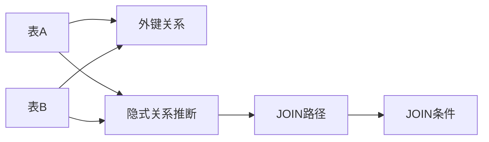

# Schema Linking: 关系推断

## 概述

关系推断用于发现数据库表之间的隐式关系，辅助生成正确的JOIN条件，实现跨表查询。



---

## 关系类型

### 1. 显式外键关系

**定义**：数据库中明确定义的外键约束。

**识别方法**：
```java
import java.sql.*;
import java.util.*;

public class ForeignKeyExtractor {
    
    private final Connection connection;
    
    public ForeignKeyExtractor(Connection connection) {
        this.connection = connection;
    }
    
    public List<ForeignKeyInfo> getForeignKeys(String tableName) throws SQLException {
        List<ForeignKeyInfo> foreignKeys = new ArrayList<>();
        
        DatabaseMetaData metaData = connection.getMetaData();
        
        try (ResultSet rs = metaData.getExportedKeys(connection.getCatalog(), null, tableName)) {
            while (rs.next()) {
                ForeignKeyInfo fk = new ForeignKeyInfo();
                fk.setFkTableName(rs.getString("FKTABLE_NAME"));
                fk.setFkColumnName(rs.getString("FKCOLUMN_NAME"));
                fk.setPkTableName(rs.getString("PKTABLE_NAME"));
                fk.setPkColumnName(rs.getString("PKCOLUMN_NAME"));
                fk.setKeySeq(rs.getShort("KEY_SEQ"));
                
                foreignKeys.add(fk);
            }
        }
        
        return foreignKeys;
    }
    
    public Map<String, List<ForeignKeyInfo>> getAllForeignKeys(List<String> tables) 
            throws SQLException {
        Map<String, List<ForeignKeyInfo>> allKeys = new HashMap<>();
        
        for (String table : tables) {
            allKeys.put(table, getForeignKeys(table));
        }
        
        return allKeys;
    }
    
    public static class ForeignKeyInfo {
        private String fkTableName;
        private String fkColumnName;
        private String pkTableName;
        private String pkColumnName;
        private short keySeq;
        
        public String getFkTableName() { return fkTableName; }
        public void setFkTableName(String fkTableName) { this.fkTableName = fkTableName; }
        public String getFkColumnName() { return fkColumnName; }
        public void setFkColumnName(String fkColumnName) { this.fkColumnName = fkColumnName; }
        public String getPkTableName() { return pkTableName; }
        public void setPkTableName(String pkTableName) { this.pkTableName = pkTableName; }
        public String getPkColumnName() { return pkColumnName; }
        public void setPkColumnName(String pkColumnName) { this.pkColumnName = pkColumnName; }
        public short getKeySeq() { return keySeq; }
        public void setKeySeq(short keySeq) { this.keySeq = keySeq; }
        
        @Override
        public String toString() {
            return String.format("%s.%s -> %s.%s", 
                fkTableName, fkColumnName, pkTableName, pkColumnName);
        }
    }
}
```

---

### 2. 隐式关系推断

#### 2.1 列名相似度推断

**Java实现**：
```java
public class ColumnSimilarityInferrer {
    
    private final double threshold;
    private final LevenshteinDistance levenshtein;
    
    public ColumnSimilarityInferrer(double threshold) {
        this.threshold = threshold;
        this.levenshtein = new LevenshteinDistance();
    }
    
    public List<ImplicitRelation> inferRelations(TableSchema table1, TableSchema table2) {
        List<ImplicitRelation> relations = new ArrayList<>();
        
        for (ColumnSchema col1 : table1.getColumns()) {
            for (ColumnSchema col2 : table2.getColumns()) {
                double similarity = calculateSimilarity(col1.getName(), col2.getName());
                
                if (similarity >= threshold) {
                    relations.add(new ImplicitRelation(
                        table1.getTableName(), col1.getName(),
                        table2.getTableName(), col2.getName(),
                        similarity, RelationType.COLUMN_SIMILARITY
                    ));
                }
            }
        }
        
        return relations;
    }
    
    private double calculateSimilarity(String name1, String name2) {
        String n1 = normalize(name1);
        String n2 = normalize(name2);
        
        if (n1.equals(n2)) {
            return 1.0;
        }
        
        int distance = levenshtein.calculate(n1, n2);
        int maxLen = Math.max(n1.length(), n2.length());
        
        return 1.0 - ((double) distance / maxLen);
    }
    
    private String normalize(String name) {
        return name.toLowerCase()
                   .replace("_", "")
                   .replace("-", "")
                   .replace(" ", "");
    }
    
    public enum RelationType {
        COLUMN_SIMILARITY,
        TYPE_MATCHING,
        VALUE_OVERLAP
    }
    
    public static class ImplicitRelation {
        private final String table1;
        private final String column1;
        private final String table2;
        private final String column2;
        private final double confidence;
        private final RelationType type;
        
        public ImplicitRelation(String table1, String column1, 
                              String table2, String column2,
                              double confidence, RelationType type) {
            this.table1 = table1;
            this.column1 = column1;
            this.table2 = table2;
            this.column2 = column2;
            this.confidence = confidence;
            this.type = type;
        }
        
        public String getTable1() { return table1; }
        public String getColumn1() { return column1; }
        public String getTable2() { return table2; }
        public String getColumn2() { return column2; }
        public double getConfidence() { return confidence; }
        public RelationType getType() { return type; }
    }
}
```

#### 2.2 类型匹配推断

```java
import java.util.*;

public class TypeMatchingInferrer {
    
    private static final Map<String, Set<String>> TYPE_COMPATIBILITY = new HashMap<>();
    
    static {
        TYPE_COMPATIBILITY.put("INT", Set.of("INT", "BIGINT", "SMALLINT", "TINYINT", "INTEGER"));
        TYPE_COMPATIBILITY.put("VARCHAR", Set.of("VARCHAR", "CHAR", "TEXT", "NVARCHAR"));
        TYPE_COMPATIBILITY.put("DATE", Set.of("DATE", "DATETIME", "TIMESTAMP", "TIME"));
        TYPE_COMPATIBILITY.put("DECIMAL", Set.of("DECIMAL", "FLOAT", "DOUBLE", "NUMERIC", "REAL"));
    }
    
    public boolean areCompatible(String type1, String type2) {
        String normalized1 = normalize(type1);
        String normalized2 = normalize(type2);
        
        if (normalized1.equals(normalized2)) {
            return true;
        }
        
        for (Set<String> compatibleSet : TYPE_COMPATIBILITY.values()) {
            if (compatibleSet.contains(normalized1) && compatibleSet.contains(normalized2)) {
                return true;
            }
        }
        
        return false;
    }
    
    private String normalize(String type) {
        return type.toUpperCase().split("\\(")[0].trim();
    }
    
    public List<ImplicitRelation> inferByType(TableSchema table1, TableSchema table2) {
        List<ImplicitRelation> relations = new ArrayList<>();
        
        for (ColumnSchema col1 : table1.getColumns()) {
            for (ColumnSchema col2 : table2.getColumns()) {
                if (areCompatible(col1.getDataType(), col2.getDataType())) {
                    relations.add(new ImplicitRelation(
                        table1.getTableName(), col1.getName(),
                        table2.getTableName(), col2.getName(),
                        0.7, RelationType.TYPE_MATCHING
                    ));
                }
            }
        }
        
        return relations;
    }
}
```

---

## JOIN路径生成

### 1. 直接JOIN

```java
public class JoinClauseGenerator {
    
    public String generateDirectJoin(ForeignKeyInfo fk) {
        return String.format("%s.%s = %s.%s",
            fk.getFkTableName(),
            fk.getFkColumnName(),
            fk.getPkTableName(),
            fk.getPkColumnName()
        );
    }
    
    public String generateJoinClause(String leftTable, String leftColumn, 
                                   String rightTable, String rightColumn) {
        return String.format("%s.%s = %s.%s",
            leftTable, leftColumn, rightTable, rightColumn);
    }
}
```

---

### 2. 间接JOIN（多跳）

```java
import java.util.*;

public class JoinPathFinder {
    
    private final Map<String, List<String>> graph;
    private final Map<String, Map<String, JoinCondition>> edgeConditions;
    
    public JoinPathFinder() {
        this.graph = new HashMap<>();
        this.edgeConditions = new HashMap<>();
    }
    
    public void addEdge(String from, String to, JoinCondition condition) {
        graph.computeIfAbsent(from, k -> new ArrayList<>()).add(to);
        graph.computeIfAbsent(to, k -> new ArrayList<>()).add(from);
        
        edgeConditions.computeIfAbsent(from, k -> new HashMap<>()).put(to, condition);
        edgeConditions.computeIfAbsent(to, k -> new HashMap<>()).put(from, 
            new JoinCondition(condition.getRightTable(), condition.getRightColumn(),
                             condition.getLeftTable(), condition.getLeftColumn()));
    }
    
    public List<String> findShortestPath(String source, String target) {
        if (!graph.containsKey(source) || !graph.containsKey(target)) {
            return Collections.emptyList();
        }
        
        Map<String, String> prev = new HashMap<>();
        Set<String> visited = new HashSet<>();
        Queue<String> queue = new LinkedList<>();
        
        queue.offer(source);
        visited.add(source);
        
        while (!queue.isEmpty()) {
            String current = queue.poll();
            
            if (current.equals(target)) {
                return reconstructPath(prev, source, target);
            }
            
            for (String neighbor : graph.getOrDefault(current, Collections.emptyList())) {
                if (!visited.contains(neighbor)) {
                    visited.add(neighbor);
                    prev.put(neighbor, current);
                    queue.offer(neighbor);
                }
            }
        }
        
        return Collections.emptyList();
    }
    
    private List<String> reconstructPath(Map<String, String> prev, String source, String target) {
        List<String> path = new ArrayList<>();
        String current = target;
        
        while (current != null) {
            path.add(0, current);
            current = prev.get(current);
        }
        
        return path;
    }
    
    public List<JoinCondition> generateJoinConditions(List<String> path) {
        List<JoinCondition> conditions = new ArrayList<>();
        
        for (int i = 0; i < path.size() - 1; i++) {
            String from = path.get(i);
            String to = path.get(i + 1);
            
            JoinCondition condition = edgeConditions.get(from).get(to);
            conditions.add(condition);
        }
        
        return conditions;
    }
    
    public String buildJoinClause(String sourceTable, String targetTable) {
        List<String> path = findShortestPath(sourceTable, targetTable);
        
        if (path.isEmpty()) {
            return "";
        }
        
        List<JoinCondition> joins = generateJoinConditions(path);
        StringBuilder sb = new StringBuilder();
        
        sb.append("FROM ").append(path.get(0));
        
        for (JoinCondition join : joins) {
            sb.append("\nINNER JOIN ").append(join.getRightTable())
              .append(" ON ").append(join.getLeftTable()).append(".").append(join.getLeftColumn())
              .append(" = ").append(join.getRightTable()).append(".").append(join.getRightColumn());
        }
        
        return sb.toString();
    }
    
    public static class JoinCondition {
        private final String leftTable;
        private final String leftColumn;
        private final String rightTable;
        private final String rightColumn;
        
        public JoinCondition(String leftTable, String leftColumn, 
                           String rightTable, String rightColumn) {
            this.leftTable = leftTable;
            this.leftColumn = leftColumn;
            this.rightTable = rightTable;
            this.rightColumn = rightColumn;
        }
        
        public String getLeftTable() { return leftTable; }
        public String getLeftColumn() { return leftColumn; }
        public String getRightTable() { return rightTable; }
        public String getRightColumn() { return rightColumn; }
    }
}
```

---

### 3. 多路径选择

```java
import java.util.*;

public class PathSelector {
    
    private final Map<String, TableStats> tableStats;
    
    public PathSelector(Map<String, TableStats> tableStats) {
        this.tableStats = tableStats;
    }
    
    public List<String> selectBestPath(List<List<String>> paths) {
        if (paths.isEmpty()) {
            return Collections.emptyList();
        }
        
        List<PathScore> scoredPaths = new ArrayList<>();
        for (List<String> path : paths) {
            scoredPaths.add(new PathScore(path, scorePath(path)));
        }
        
        scoredPaths.sort((a, b) -> Double.compare(b.score, a.score));
        return scoredPaths.get(0).path;
    }
    
    private double scorePath(List<String> path) {
        double score = 0.0;
        
        for (String table : path) {
            TableStats stats = tableStats.get(table);
            
            if (stats != null) {
                double sizeScore = 1.0 / (1 + Math.log(stats.getRowCount() + 1));
                double indexScore = stats.isHasIndex() ? 1.2 : 1.0;
                score += sizeScore * indexScore;
            }
        }
        
        return score;
    }
    
    public static class TableStats {
        private final long rowCount;
        private final boolean hasIndex;
        private final Map<String, IndexInfo> indexes;
        
        public TableStats(long rowCount, boolean hasIndex) {
            this.rowCount = rowCount;
            this.hasIndex = hasIndex;
            this.indexes = new HashMap<>();
        }
        
        public long getRowCount() { return rowCount; }
        public boolean isHasIndex() { return hasIndex; }
    }
    
    private static class PathScore {
        final List<String> path;
        final double score;
        
        PathScore(List<String> path, double score) {
            this.path = path;
            this.score = score;
        }
    }
}
```

---

### 4. 图结构构建

```java
import java.sql.*;
import java.util.*;

public class SchemaGraphBuilder {
    
    private final Map<String, TableSchema> tables;
    private final Map<String, List<String>> adjacencyList;
    private final Map<String, Map<String, JoinCondition>> edgeConditions;
    
    public SchemaGraphBuilder() {
        this.tables = new HashMap<>();
        this.adjacencyList = new HashMap<>();
        this.edgeConditions = new HashMap<>();
    }
    
    public SchemaGraphBuilder addTable(TableSchema schema) {
        tables.put(schema.getTableName(), schema);
        adjacencyList.putIfAbsent(schema.getTableName(), new ArrayList<>());
        return this;
    }
    
    public SchemaGraphBuilder addForeignKey(ForeignKeyInfo fk) {
        adjacencyList.computeIfAbsent(fk.getFkTableName(), k -> new ArrayList<>())
                    .add(fk.getPkTableName());
        adjacencyList.computeIfAbsent(fk.getPkTableName(), k -> new ArrayList<>())
                    .add(fk.getFkTableName());
        
        JoinCondition condition = new JoinCondition(
            fk.getFkTableName(), fk.getFkColumnName(),
            fk.getPkTableName(), fk.getPkColumnName()
        );
        
        edgeConditions.computeIfAbsent(fk.getFkTableName(), k -> new HashMap<>())
                     .put(fk.getPkTableName(), condition);
        edgeConditions.computeIfAbsent(fk.getPkTableName(), k -> new HashMap<>())
                     .put(fk.getFkTableName(), 
                         new JoinCondition(fk.getPkTableName(), fk.getPkColumnName(),
                                         fk.getFkTableName(), fk.getFkColumnName()));
        
        return this;
    }
    
    public SchemaGraphBuilder addImplicitRelation(ImplicitRelation relation) {
        String table1 = relation.getTable1();
        String table2 = relation.getTable2();
        
        adjacencyList.computeIfAbsent(table1, k -> new ArrayList<>()).add(table2);
        adjacencyList.computeIfAbsent(table2, k -> new ArrayList<>()).add(table1);
        
        JoinCondition condition = new JoinCondition(
            table1, relation.getColumn1(),
            table2, relation.getColumn2()
        );
        
        edgeConditions.computeIfAbsent(table1, k -> new HashMap<>())
                     .put(table2, condition);
        edgeConditions.computeIfAbsent(table2, k -> new HashMap<>())
                     .put(table1, new JoinCondition(
                         table2, relation.getColumn2(),
                         table1, relation.getColumn1()
                     ));
        
        return this;
    }
    
    public JoinPathFinder build() {
        JoinPathFinder finder = new JoinPathFinder();
        
        for (Map.Entry<String, List<String>> entry : adjacencyList.entrySet()) {
            String from = entry.getKey();
            for (String to : entry.getValue()) {
                JoinCondition condition = edgeConditions.get(from).get(to);
                finder.addEdge(from, to, condition);
            }
        }
        
        return finder;
    }
    
    public Map<String, TableSchema> getTables() {
        return Collections.unmodifiableMap(tables);
    }
}
```

---

## 异常处理

| Exception | Category | Trigger | Strategy |
|-----------|----------|---------|----------|
| 循环外键 | Schema | 存在循环引用 | 跳过该关系 |
| 缺失外键信息 | Input | FK = [] | 使用隐式推断 |
| 无法找到JOIN路径 | Result | path = [] | 返回错误 |
| 多表JOIN过多 | Service | hops > 5 | 警告用户 |

---

## 边界条件

| Parameter | Min | Max | Unit | Handling |
|-----------|-----|-----|------|----------|
| 最大JOIN hops | 1 | 5 | count | 超出警告 |
| 相似度阈值 | 0.5 | 1.0 | ratio | 限制范围 |
| 候选路径数 | 1 | 10 | count | 限制范围 |
| 关系置信度 | 0.0 | 1.0 | ratio | 过滤低置信度 |

---

## 性能指标

| 指标 | 目标值 | 说明 |
|------|--------|------|
| 图构建时间 | ≤500ms | 100表规模 |
| 最短路径查询 | ≤10ms | 单次查询 |
| 路径生成 | ≤50ms | 完整JOIN |
| 内存占用 | ≤100MB | 100表图结构 |

---

## 优缺点

### 优点
- 自动发现表间关系
- 减少人工配置
- 支持复杂多表查询

### 缺点
- 隐式关系可能不准确
- 性能开销较大
- 需要数据库统计信息
