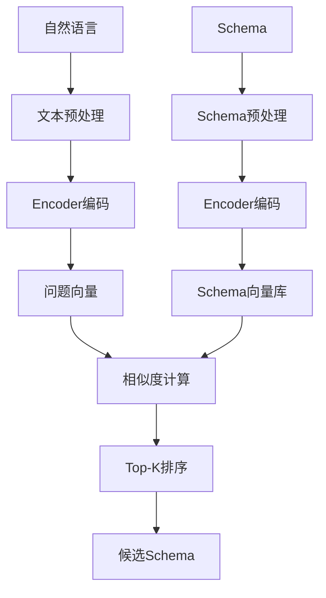

# Schema Linking: 语义嵌入匹配

## 概述

语义嵌入匹配通过将自然语言和Schema元素映射到高维向量空间，利用向量相似度实现语义对齐。



---

## 嵌入模型

### 1. 模型选择

| 模型 | 维度 | 速度 | 准确性 | 适用场景 |
|------|------|------|--------|----------|
| all-MiniLM-L6-v2 | 384 | 快 | 中 | 实时匹配 |
| all-mpnet-base-v2 | 768 | 中 | 高 | 精确匹配 |
| paraphrase-multilingual-MiniLM-L12-v2 | 384 | 中 | 高 | 多语言 |

---

### 2. 语义编码器

**Java接口定义**：
```java
public interface SemanticEncoder {
    
    float[] encode(String text);
    
    float[][] batchEncode(List<String> texts);
    
    int getDimension();
}
```

**实现类**：
```java
public class HuggingFaceEncoder implements SemanticEncoder {
    
    private final String modelPath;
    private final int dimension;
    private Object tokenizer;
    private Object model;
    
    public HuggingFaceEncoder(String modelPath) {
        this.modelPath = modelPath;
        this.dimension = loadModel(modelPath);
    }
    
    @Override
    public float[] encode(String text) {
        if (text == null || text.isEmpty()) {
            return new float[dimension];
        }
        
        List<Long> inputIds = tokenizer.encode(text);
        float[][] outputs = model.forward(inputIds);
        
        return averagePooling(outputs[0], inputIds.size());
    }
    
    @Override
    public float[][] batchEncode(List<String> texts) {
        float[][] results = new float[texts.size()][dimension];
        for (int i = 0; i < texts.size(); i++) {
            results[i] = encode(texts.get(i));
        }
        return results;
    }
    
    @Override
    public int getDimension() {
        return dimension;
    }
    
    private float[] averagePooling(float[][] hiddenStates, int seqLen) {
        float[] pooled = new float[dimension];
        for (int i = 0; i < dimension; i++) {
            float sum = 0;
            for (int j = 0; j < seqLen; j++) {
                sum += hiddenStates[j][i];
            }
            pooled[i] = sum / seqLen;
        }
        return pooled;
    }
    
    private int loadModel(String path) {
        this.tokenizer = TokenizerLoader.load(path + "/tokenizer.json");
        this.model = ModelLoader.load(path + "/model.bin");
        return ModelLoader.getDimension(path);
    }
}
```

---

## 相似度计算

### 余弦相似度

**公式**：
```
cosine(A, B) = (A · B) / (||A|| × ||B||)
```

**Java实现**：
```java
public class CosineSimilarity {
    
    public static float calculate(float[] a, float[] b) {
        if (a == null || b == null || a.length != b.length) {
            throw new IllegalArgumentException("Vectors must be non-null and have same dimension");
        }
        
        float dotProduct = 0.0f;
        float normA = 0.0f;
        float normB = 0.0f;
        
        for (int i = 0; i < a.length; i++) {
            dotProduct += a[i] * b[i];
            normA += a[i] * a[i];
            normB += b[i] * b[i];
        }
        
        normA = (float) Math.sqrt(normA);
        normB = (float) Math.sqrt(normB);
        
        if (normA == 0 || normB == 0) {
            return 0.0f;
        }
        
        return dotProduct / (normA * normB);
    }
    
    public static float calculateBatch(float[] query, float[][] candidates) {
        float maxSimilarity = -1.0f;
        for (float[] candidate : candidates) {
            float sim = calculate(query, candidate);
            if (sim > maxSimilarity) {
                maxSimilarity = sim;
            }
        }
        return maxSimilarity;
    }
}
```

---

## Schema编码策略

### 1. 基础编码

```java
public class SchemaEncoder {
    
    public String encodeBasic(TableSchema schema) {
        StringBuilder sb = new StringBuilder();
        
        sb.append(schema.getTableName());
        if (schema.getComment() != null) {
            sb.append(" ").append(schema.getComment());
        }
        
        for (ColumnSchema col : schema.getColumns()) {
            sb.append(" | ");
            sb.append(col.getName());
            if (col.getComment() != null) {
                sb.append(" ").append(col.getComment());
            }
        }
        
        return sb.toString();
    }
    
    public String encodeHierarchical(TableSchema schema) {
        StringBuilder sb = new StringBuilder();
        
        sb.append("Table: ").append(schema.getTableName());
        if (schema.getComment() != null) {
            sb.append(" - ").append(schema.getComment());
        }
        sb.append("\nColumns:\n");
        
        for (ColumnSchema col : schema.getColumns()) {
            sb.append("  - ").append(col.getName());
            sb.append(" (").append(col.getType()).append(")");
            if (col.getComment() != null) {
                sb.append(": ").append(col.getComment());
            }
            sb.append("\n");
        }
        
        return sb.toString();
    }
}
```

---

### 2. 向量索引

**Java实现**：
```java
import java.util.*;
import java.util.concurrent.*;

public class SchemaVectorIndex {
    
    private final SemanticEncoder encoder;
    private final Map<String, float[]> vectorStore;
    private final List<String> tableNames;
    private final float[][] vectors;
    
    public SchemaVectorIndex(SemanticEncoder encoder) {
        this.encoder = encoder;
        this.vectorStore = new HashMap<>();
        this.tableNames = new ArrayList<>();
    }
    
    public void buildIndex(List<TableSchema> schemas) {
        for (TableSchema schema : schemas) {
            String text = encodeSchema(schema);
            float[] vector = encoder.encode(text);
            vectorStore.put(schema.getTableName(), vector);
            tableNames.add(schema.getTableName());
        }
        
        vectors = new float[tableNames.size()][encoder.getDimension()];
        for (int i = 0; i < tableNames.size(); i++) {
            vectors[i] = vectorStore.get(tableNames.get(i));
        }
    }
    
    public List<MatchResult> search(String query, int topK) {
        float[] queryVector = encoder.encode(query);
        
        PriorityQueue<MatchResult> pq = new PriorityQueue<>(
            Comparator.comparingDouble(MatchResult::getScore).reversed()
        );
        
        for (int i = 0; i < tableNames.size(); i++) {
            float score = CosineSimilarity.calculate(queryVector, vectors[i]);
            pq.offer(new MatchResult(tableNames.get(i), score));
        }
        
        List<MatchResult> results = new ArrayList<>();
        for (int i = 0; i < topK && !pq.isEmpty(); i++) {
            results.add(pq.poll());
        }
        
        return results;
    }
    
    private String encodeSchema(TableSchema schema) {
        StringBuilder sb = new StringBuilder();
        sb.append(schema.getTableName());
        if (schema.getComment() != null) {
            sb.append(" ").append(schema.getComment());
        }
        for (ColumnSchema col : schema.getColumns()) {
            sb.append(" ").append(col.getName());
            if (col.getComment() != null) {
                sb.append(" ").append(col.getComment());
            }
        }
        return sb.toString();
    }
    
    public static class MatchResult {
        private final String tableName;
        private final float score;
        
        public MatchResult(String tableName, float score) {
            this.tableName = tableName;
            this.score = score;
        }
        
        public String getTableName() { return tableName; }
        public float getScore() { return score; }
    }
}
```

---

### 3. 缓存策略

```java
import java.util.*;
import java.util.concurrent.*;

public class CachedSemanticMatcher {
    
    private final SemanticEncoder encoder;
    private final Map<String, float[]> embeddingCache;
    private final int maxCacheSize;
    private final LoadingCache<String, float[]> loadingCache;
    
    public CachedSemanticMatcher(SemanticEncoder encoder, int maxCacheSize) {
        this.encoder = encoder;
        this.embeddingCache = new LinkedHashMap<>(maxCacheSize, 0.75f, true) {
            @Override
            protected boolean removeEldestEntry(Map.Entry eldest) {
                return size() > maxCacheSize;
            }
        };
        this.maxCacheSize = maxCacheSize;
        
        this.loadingCache = CacheBuilder.newBuilder()
            .maximumSize(maxCacheSize)
            .build(new CacheLoader<String, float[]>() {
                @Override
                public float[] load(String key) {
                    return encoder.encode(key);
                }
            });
    }
    
    public float[] encode(String text) {
        return loadingCache.getUnchecked(text);
    }
    
    public float[][] batchEncode(List<String> texts) {
        float[][] results = new float[texts.size()][];
        for (int i = 0; i < texts.size(); i++) {
            results[i] = encode(texts.get(i));
        }
        return results;
    }
    
    public void clearCache() {
        embeddingCache.clear();
        loadingCache.invalidateAll();
    }
}
```

---

## 阈值设置

| 模型 | 阈值 | 说明 |
|------|------|------|
| SBERT | ≥0.6 | 语义相似度阈值 |
| USE | ≥0.5 | 余弦相似度阈值 |
| BGE | ≥0.65 | 中文场景推荐 |

---

## 异常处理

| Exception | Category | Trigger | Strategy |
|-----------|----------|---------|----------|
| 模型加载失败 | Service | model = null | 使用备选模型 |
| 向量维度不匹配 | Result | dim(A) ≠ dim(B) | 归一化处理 |
| 空文本 | Input | text = "" | 返回全0向量 |
| OOM错误 | Service | 内存不足 | 批量处理 |

---

## 边界条件

| Parameter | Min | Max | Unit | Handling |
|-----------|-----|-----|------|----------|
| 文本长度 | 1 | 512 | token | 截断处理 |
| 向量维度 | 128 | 1536 | dim | 模型决定 |
| 批量大小 | 1 | 1000 | sample | 分批处理 |
| Top-K | 1 | 100 | count | 限制范围 |

---

## 性能指标

| 指标 | 目标值 | 说明 |
|------|--------|------|
| 单次查询延迟 | ≤50ms | 含模型推理 |
| 批量编码速度 | ≥500 docs/s | MiniLM-L6-v2 |
| 索引构建速度 | ≥1000 tables/s | 离线处理 |
| 内存占用 | ≤2GB | 10000表索引 |

---

## 优缺点

### 优点
- 支持语义相似匹配
- 可处理同义词
- 对拼写错误鲁棒

### 缺点
- 计算成本较高
- 需要额外存储向量
- 模型依赖性强
