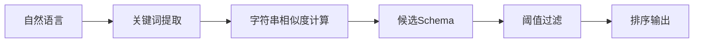

# Schema Linking: 字符串相似度匹配

## 概述

字符串相似度匹配是Schema Linking的基础方法，通过计算自然语言文本与数据库表名、列名之间的字符串相似度来实现对齐。



---

## 算法详解

### 1. Levenshtein距离

**定义**：两个字符串之间，由一个转成另一个所需的最少单字符编辑操作次数。

**操作类型**：
- 插入（Insert）
- 删除（Delete）
- 替换（Replace）

**计算公式**：
```
levenshtein_distance(s1, s2) = 编辑次数
```

**相似度转换**：
```
similarity = 1 - (distance / max(len(s1), len(s2)))
```

**Java实现**：
```java
public class LevenshteinDistance {
    
    public static int calculate(String s1, String s2) {
        if (s1 == null) s1 = "";
        if (s2 == null) s2 = "";
        
        int len1 = s1.length();
        int len2 = s2.length();
        
        if (len1 == 0) return len2;
        if (len2 == 0) return len1;
        
        int[][] dp = new int[len1 + 1][len2 + 1];
        
        for (int i = 0; i <= len1; i++) {
            dp[i][0] = i;
        }
        for (int j = 0; j <= len2; j++) {
            dp[0][j] = j;
        }
        
        for (int i = 1; i <= len1; i++) {
            for (int j = 1; j <= len2; j++) {
                int cost = s1.charAt(i - 1) == s2.charAt(j - 1) ? 0 : 1;
                dp[i][j] = Math.min(
                    Math.min(dp[i - 1][j] + 1, dp[i][j - 1] + 1),
                    dp[i - 1][j - 1] + cost
                );
            }
        }
        
        return dp[len1][len2];
    }
    
    public static double similarity(String s1, String s2) {
        if (s1 == null || s2 == null) return 0.0;
        if (s1.isEmpty() && s2.isEmpty()) return 1.0;
        
        int distance = calculate(s1, s2);
        int maxLen = Math.max(s1.length(), s2.length());
        
        return 1.0 - ((double) distance / maxLen);
    }
}
```

**时间复杂度**：O(m × n)

---

### 2. Jaccard相似度

**定义**：两个集合的交集与并集之比。

**计算公式**：
```
jaccard(A, B) = |A ∩ B| / |A ∪ B|
```

**用于字符串匹配**：
- 将字符串分割为n-gram集合
- 计算集合的Jaccard相似度

**Java实现**：
```java
import java.util.*;
import java.util.stream.Collectors;

public class JaccardSimilarity {
    
    public static Set<String> getNgrams(String text, int n) {
        if (text == null) text = "";
        text = text.toLowerCase().replace(" ", "");
        
        Set<String> ngrams = new HashSet<>();
        for (int i = 0; i <= text.length() - n; i++) {
            ngrams.add(text.substring(i, i + n));
        }
        return ngrams;
    }
    
    public static double calculate(String s1, String s2, int n) {
        Set<String> grams1 = getNgrams(s1, n);
        Set<String> grams2 = getNgrams(s2, n);
        
        Set<String> intersection = new HashSet<>(grams1);
        intersection.retainAll(grams2);
        
        Set<String> union = new HashSet<>(grams1);
        union.addAll(grams2);
        
        if (union.isEmpty()) {
            return 0.0;
        }
        
        return (double) intersection.size() / union.size();
    }
}
```

---

### 3. 中文拼音匹配

**适用场景**：中文表名/列名与拼音之间的匹配。

**Java实现**：
```java
import net.sourceforge.pinyin4j.PinyinHelper;

public class PinyinMatcher {
    
    public static String toPinyin(String chinese) {
        if (chinese == null || chinese.isEmpty()) {
            return "";
        }
        
        StringBuilder pinyin = new StringBuilder();
        for (char c : chinese.toCharArray()) {
            String[] pinyins = PinyinHelper.toHanyuPinyinStringArray(c);
            if (pinyins != null && pinyins.length > 0) {
                pinyin.append(pinyins[0]);
            } else {
                pinyin.append(c);
            }
        }
        return pinyin.toString();
    }
    
    public static double similarity(String chineseText, String pinyinText) {
        String pinyin = toPinyin(chineseText);
        return LevenshteinDistance.similarity(pinyin, pinyinText.toLowerCase());
    }
}
```

---

### 4. 子串匹配

**定义**：检查目标字符串是否包含源字符串。

**Java实现**：
```java
public class SubstringMatcher {
    
    public static boolean contains(String text, String pattern) {
        if (text == null || pattern == null) return false;
        return text.toLowerCase().contains(pattern.toLowerCase());
    }
    
    public static int longestCommonSubstring(String s1, String s2) {
        if (s1 == null || s2 == null) return 0;
        
        int m = s1.length();
        int n = s2.length();
        int maxLen = 0;
        
        int[] prev = new int[n + 1];
        int[] curr = new int[n + 1];
        
        for (int i = 1; i <= m; i++) {
            for (int j = 1; j <= n; j++) {
                if (s1.charAt(i - 1) == s2.charAt(j - 1)) {
                    curr[j] = prev[j - 1] + 1;
                    maxLen = Math.max(maxLen, curr[j]);
                } else {
                    curr[j] = 0;
                }
            }
            int[] temp = prev;
            prev = curr;
            curr = temp;
        }
        
        return maxLen;
    }
}
```

---

### 5. 字符串匹配器

```java
import java.util.*;
import java.util.stream.Collectors;

public class StringSchemaMatcher {
    
    private final double levenshteinThreshold;
    private final double jaccardThreshold;
    
    public StringSchemaMatcher(double levenshteinThreshold, double jaccardThreshold) {
        this.levenshteinThreshold = levenshteinThreshold;
        this.jaccardThreshold = jaccardThreshold;
    }
    
    public static class MatchResult {
        private final String schemaElement;
        private final double score;
        private final String matchType;
        
        public MatchResult(String schemaElement, double score, String matchType) {
            this.schemaElement = schemaElement;
            this.score = score;
            this.matchType = matchType;
        }
        
        public String getSchemaElement() { return schemaElement; }
        public double getScore() { return score; }
        public String getMatchType() { return matchType; }
    }
    
    public List<MatchResult> match(String query, List<String> schemaElements) {
        List<MatchResult> results = new ArrayList<>();
        String normalizedQuery = query.toLowerCase().trim();
        
        for (String element : schemaElements) {
            String normalizedElement = element.toLowerCase();
            
            // 精确匹配
            if (normalizedQuery.equals(normalizedElement)) {
                results.add(new MatchResult(element, 1.0, "exact"));
                continue;
            }
            
            // 子串匹配
            if (contains(normalizedElement, normalizedQuery) ||
                contains(normalizedQuery, normalizedElement)) {
                results.add(new MatchResult(element, 0.9, "substring"));
                continue;
            }
            
            // Levenshtein相似度
            double levSim = LevenshteinDistance.similarity(normalizedQuery, normalizedElement);
            if (levSim >= levenshteinThreshold) {
                results.add(new MatchResult(element, levSim, "levenshtein"));
                continue;
            }
            
            // Jaccard相似度
            double jacSim = JaccardSimilarity.calculate(normalizedQuery, normalizedElement, 2);
            if (jacSim >= jaccardThreshold) {
                results.add(new MatchResult(element, jacSim, "jaccard"));
            }
        }
        
        // 按分数排序
        results.sort((a, b) -> Double.compare(b.getScore(), a.getScore()));
        
        return results;
    }
    
    private boolean contains(String text, String pattern) {
        return text.contains(pattern);
    }
}
```

---

## 阈值设置

| 方法 | 阈值 | 说明 |
|------|------|------|
| Levenshtein | ≥0.7 | 相似度阈值 |
| Jaccard (2-gram) | ≥0.5 | 2-gram阈值 |
| 子串匹配 | 完全匹配 | 包含即可 |

---

## 异常处理

| Exception | Category | Trigger | Strategy |
|-----------|----------|---------|----------|
| 空字符串 | Input | text = "" | 跳过 |
| Unicode编码问题 | Input | 非ASCII字符 | 预处理转义 |
| 性能问题(超长字符串) | Service | len > 1000 | 使用哈希近似 |

---

## 边界条件

| Parameter | Min | Max | Unit | Handling |
|-----------|-----|-----|------|----------|
| 字符串长度 | 1 | 1000 | char | 超出截断 |
| n-gram大小 | 1 | 5 | n | 默认2 |
| 阈值范围 | 0.0 | 1.0 | ratio | 限制范围 |

---

## 性能指标

| 指标 | 目标值 | 说明 |
|------|--------|------|
| 单次匹配延迟 | ≤10ms | 单对字符串 |
| 批量匹配延迟 | ≤100ms | 1000对 |
| 内存占用 | ≤50MB | 缓存开销 |

---

## 优缺点

### 优点
- 计算简单，速度快
- 可解释性强
- 适用于精确匹配场景

### 缺点
- 无法处理语义相似但字面不同的情况
- 对拼写错误敏感
- 无法理解同义词
