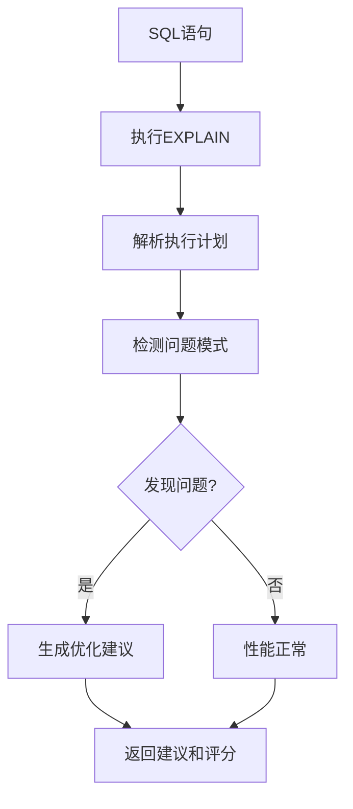

# SQL优化: 执行计划分析

## 概述

通过分析数据库的EXPLAIN执行计划，识别性能问题并提供优化建议。



---

## 接口定义

### ExplainAnalyzer 接口

**核心作用**：执行计划分析的抽象接口，定义统一的分析规范。

| 方法 | 参数 | 返回值 | 说明 |
|------|------|--------|------|
| `analyze` | String sql | `ExecutionPlan` | 分析SQL执行计划 |
| `detectIssues` | `ExecutionPlan` plan | `List<PerformanceIssue>` | 检测性能问题 |
| `getAnalyzerType` | - | `AnalyzerType` | 获取分析器类型 |

### ExecutionPlan 结果

| 字段 | 类型 | 说明 |
|------|------|------|
| rawPlan | String | 原始执行计划 |
| issues | List<PerformanceIssue> | 检测到的问题列表 |
| score | double | 性能评分(0-100) |
| totalCost | double | 总成本估算 |

### PerformanceIssue 问题

| 字段 | 类型 | 说明 |
|------|------|------|
| type | String | 问题类型 |
| description | String | 问题描述 |
| severity | `Severity` | 严重程度 |
| suggestion | String | 优化建议 |

### Severity 枚举

| 枚举值 | 说明 | 扣分权重 |
|--------|------|----------|
| CRITICAL | 严重 | -30 |
| HIGH | 高 | -20 |
| MEDIUM | 中 | -10 |
| LOW | 低 | -5 |

---

## 1. MySQL执行计划解析

### 构造方法

| 参数 | 类型 | 说明 |
|------|------|------|
| connection | `Connection` | JDBC数据库连接 |

### 核心方法

| 方法 | 参数 | 返回值 | 说明 |
|------|------|--------|------|
| `analyze` | String sql | `ExecutionPlan` | 执行EXPLAIN并解析 |
| `parseJsonPlan` | String json | `ExecutionPlan` | 解析JSON格式计划 |
| `detectFullScans` | String json | `List<PerformanceIssue>` | 检测全表扫描 |
| `detectIndexUsage` | String json | `List<PerformanceIssue>` | 检测索引使用 |
| `extractCost` | String json | double | 提取成本值 |

### 检测规则表

| 检测项 | 条件 | 问题类型 | 严重程度 | 建议 |
|--------|------|----------|----------|------|
| 全表扫描 | 包含`"type": "ALL"` | 全表扫描 | HIGH | 为过滤列添加索引 |
| 文件排序 | 包含`"using filesort"` | 文件排序 | MEDIUM | 为排序列添加索引 |
| 临时表 | 包含`"using temporary"` | 临时表 | MEDIUM | 优化查询避免临时表 |
| 未使用索引 | `key`为null | 未使用索引 | HIGH | 检查WHERE/JOIN条件列索引 |
| 嵌套循环过多 | 嵌套层数>3 | 多层嵌套循环 | HIGH | 简化查询或用JOIN替代子查询 |

### 执行步骤

```
1. 构建EXPLAIN语句
   EXPLAIN FORMAT=JSON <sql>
         ↓
2. 执行查询获取JSON计划
         ↓
3. 解析JSON提取关键信息
   - 扫描类型 (type)
   - 索引使用 (key)
   - 成本估算 (query_cost)
         ↓
4. 检测性能问题
   - 全表扫描检测
   - 文件排序检测
   - 临时表检测
         ↓
5. 构建ExecutionPlan返回
```

---

## 2. PostgreSQL执行计划解析

### 构造方法

| 参数 | 类型 | 说明 |
|------|------|------|
| connection | `Connection` | JDBC数据库连接 |

### 核心方法

| 方法 | 参数 | 返回值 | 说明 |
|------|------|--------|------|
| `analyze` | String sql | `ExecutionPlan` | 执行EXPLAIN并解析 |
| `detectSeqScans` | String json | `List<PerformanceIssue>` | 检测顺序扫描 |
| `detectHashJoins` | String json | `List<PerformanceIssue>` | 检测哈希连接 |
| `detectHighCostNodes` | String json | `List<PerformanceIssue>` | 检测高成本节点 |
| `extractActualTime` | String json | long | 提取实际执行时间 |

### 检测规则表

| 检测项 | 条件 | 问题类型 | 严重程度 | 建议 |
|--------|------|----------|----------|------|
| 顺序扫描 | `Seq Scan`次数>2 | 多次顺序扫描 | MEDIUM | 考虑添加索引 |
| 高磁盘IO | 读取块数>1000 | 高磁盘IO | HIGH | 增加有效缓存 |
| 高成本节点 | 节点成本>10000 | 高成本操作 | HIGH | 拆分查询或优化连接 |
| 哈希连接 | 包含`Hash Join` | 哈希连接 | LOW | 说明：通常效率较高 |

### 执行步骤

```
1. 构建EXPLAIN语句
   EXPLAIN (ANALYZE, BUFFERS, FORMAT JSON) <sql>
         ↓
2. 执行查询获取JSON计划
         ↓
3. 解析JSON提取关键信息
   - Total Cost
   - Actual Time
   - 共享块读写数
         ↓
4. 检测性能问题
   - 顺序扫描检测
   - 哈希连接检测
   - 高成本节点检测
         ↓
5. 构建ExecutionPlan返回
```

---

## 3. MongoDB执行计划解析

### 构造方法

| 参数 | 类型 | 说明 |
|------|------|------|
| database | `MongoDatabase` | MongoDB数据库实例 |

### 核心方法

| 方法 | 参数 | 返回值 | 说明 |
|------|------|--------|------|
| `analyze` | String query | `ExecutionPlan` | 执行explain并解析 |
| `parseExplainOutput` | Document result | `ExecutionPlan` | 解析explain输出 |
| `detectCollectionScans` | Document plan | `List<PerformanceIssue>` | 检测集合扫描 |
| `detectIndexUsage` | Document plan | `List<PerformanceIssue>` | 检测索引使用 |
| `detectSortOperations` | Document plan | `List<PerformanceIssue>` | 检测排序操作 |

### 检测规则表

| 检测项 | 条件 | 问题类型 | 严重程度 | 建议 |
|--------|------|----------|----------|------|
| 集合扫描 | `COLLSCAN` | 全集合扫描 | HIGH | 为过滤字段创建索引 |
| 分片扫描 | `SHARD_MERGE`/`SHARDING_FILTER` | 分片扫描 | HIGH | 优化分片键或查询条件 |
| 排序未用索引 | `SORT`且无索引 | 内存排序 | MEDIUM | 为排序列创建索引 |
| 未使用索引 | `IXSCAN`不存在 | 未使用索引 | HIGH | 检查查询条件是否匹配索引 |
| 索引范围大 | `IXSCAN`扫描范围大 | 索引效率低 | MEDIUM | 考虑创建覆盖索引 |
| 投影未优化 | 返回过多字段 | 传输开销大 | LOW | 使用投影限制返回字段 |
| 查询计划缓存 | `cachedPlan`存在 | 计划已缓存 | LOW | 说明：性能良好 |

### 执行步骤

```
1. 构建查询语句
         ↓
2. 执行explain命令
   collection.explain().find(query)
         ↓
3. 解析explain输出
   - queryPlanner.planningStats
   - executionStats
   - serverInfo
         ↓
4. 检测性能问题
   - COLLSCAN检测
   - IXSCAN使用检测
   - SORT操作检测
   - 内存限制检测
         ↓
5. 构建ExecutionPlan返回
```

### MongoDB Explain输出结构

| 字段路径 | 类型 | 说明 |
|----------|------|------|
| queryPlanner.planningTime | long | 计划生成时间(ms) |
| queryPlanner.indexFilterSet | boolean | 是否存在索引过滤 |
| queryPlanner.winningPlan.stage | String | 胜出的计划阶段 |
| queryPlanner.winningPlan.inputStage.stage | String | 输入阶段类型 |
| executionStats.executionTimeMillis | long | 执行时间(ms) |
| executionStats.nReturned | long | 返回文档数 |
| executionStats.totalDocsExamined | long | 扫描文档数 |
| executionStats.totalKeysExamined | long | 扫描索引键数 |

### 常见Stage类型表

| Stage | 说明 | 性能提示 |
|-------|------|----------|
| COLLSCAN | 全集合扫描 | 差，缺少索引 |
| IXSCAN | 索引扫描 | 好 |
| FETCH | 获取文档 | 中，可优化投影 |
| SORT | 内存排序 | 差，考虑索引 |
| LIMIT | 限制 | 好 |
| SKIP | 跳过 | 中 |
| SHARD_MERGE | 分片合并 | 中，分片查询 |
| COUNT | 计数 | 好 |
| COUNT_SCAN | 索引计数 | 最好 |
| SUBPLAN | 子计划 | 中 |
| PROJECTION | 投影 | 好 |

---

## 4. 索引建议生成

### 构造方法

| 参数 | 类型 | 说明 |
|------|------|------|
| explainAnalyzer | `ExplainAnalyzer` | 执行计划分析器 |
| statsProvider | `TableStatsProvider` | 表统计信息提供器 |

### 核心方法

| 方法 | 参数 | 返回值 | 说明 |
|------|------|--------|------|
| `generateRecommendations` | String sql | `List<IndexRecommendation>` | 生成索引建议 |
| `recommendIndexForFullScan` | String sql | `IndexRecommendation` | 针对全表扫描建议 |
| `recommendIndexForSort` | String sql | `IndexRecommendation` | 针对排序建议 |
| `extractFilterColumns` | String sql | `List<String>` | 提取过滤列 |

### IndexRecommendation 结果

| 字段 | 类型 | 说明 |
|------|------|------|
| tableName | String | 表名 |
| columns | List<String> | 建议索引的列 |
| estimatedCost | double | 预估成本 |
| reason | String | 建议原因 |
| selectivity | double | 选择性 |

### 建议生成规则表

| 问题类型 | 索引列来源 | 建议说明 |
|----------|-----------|----------|
| 全表扫描 | WHERE条件列 | 建议创建复合索引 |
| 文件排序 | ORDER BY列 | 建议创建覆盖索引 |
| 未使用索引 | WHERE/JOIN列 | 为条件列创建索引 |
| 高选择性列 | 统计信息 | 选择性>10%优先 |

### DDL生成

```java
public String toDDL() {
    return String.format("CREATE INDEX idx_%s ON %s (%s)",
        String.join("_", columns),
        tableName,
        String.join(", ", columns)
    );
}
```

---

## 5. 性能评分

### 核心方法

| 方法 | 参数 | 返回值 | 说明 |
|------|------|--------|------|
| `score` | `ExecutionPlan` | `PerformanceScore` | 计算性能评分 |
| `getPenalty` | `PerformanceIssue` | double | 获取扣分值 |
| `getGrade` | double | `Grade` | 获取评分等级 |

### 扣分规则表

| 问题类型 | 严重程度 | 扣分值 |
|----------|----------|--------|
| 全表扫描 | HIGH | -30 |
| 未使用索引 | HIGH | -25 |
| 高成本操作 | HIGH | -20 |
| 文件排序 | MEDIUM | -15 |
| 临时表 | MEDIUM | -10 |
| 其他 | LOW | -5 |

### Grade 评分等级

| 等级 | 分数范围 | 说明 | 建议 |
|------|----------|------|------|
| EXCELLENT | 90-100 | 性能优异 | 无需优化 |
| GOOD | 75-89 | 性能良好 | 可选择性优化 |
| FAIR | 60-74 | 存在一定问题 | 建议优化 |
| POOR | 40-59 | 性能问题明显 | 需要优化 |
| CRITICAL | 0-39 | 性能问题严重 | 必须优化 |

---

## 异常处理

| Exception | Category | Trigger | Strategy |
|-----------|----------|---------|----------|
| EXPLAIN执行失败 | Service | SQL语法错误 | 返回错误信息 |
| 数据库连接断开 | Service | connection == null | 重连或返回缓存 |
| 解析JSON失败 | Result | JSON格式错误 | 使用原始文本 |
| 超时 | Service | time > 30s | 终止分析 |

---

## 边界条件

| Parameter | Min | Max | Unit | Handling |
|-----------|-----|-----|------|----------|
| 分析超时 | 1 | 30 | second | 默认10秒 |
| 最大建议数 | 1 | 10 | count | 返回Top5 |
| 成本阈值 | 0 | 100000 | cost | 默认10000 |

---

## 性能指标

| 指标 | 目标值 | 说明 |
|------|--------|------|
| 分析延迟 | ≤500ms | 含EXPLAIN执行 |
| 评分准确率 | ≥90% | 与实际性能相关 |
| 建议采纳率 | ≥60% | 用户采纳建议比例 |

---

## 优缺点

### 优点
- 基于实际执行计划分析
- 准确的性能评估
- 可生成可操作的建议

### 缺点
- 需要实际执行SQL
- 增加数据库负载
- 不同数据库语法不同
