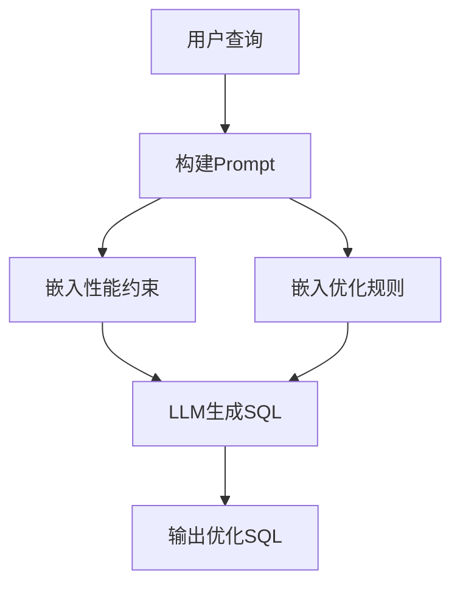

# SQL优化: 提示词嵌入

## 概述

通过在Prompt中嵌入性能最佳实践，指导LLM生成高效的SQL语句。



---

## 接口定义

### PromptBuilder 接口

**核心作用**：构建包含性能约束的Prompt。

| 方法 | 参数 | 返回值 | 说明 |
|------|------|--------|------|
| `build` | userQuery, schema | String | 构建完整Prompt |
| `build` | userQuery, schema, options | String | 带选项构建Prompt |
| `schemaToString` | schema | String | Schema转字符串 |

### OptimizationOptions 配置

| 字段 | 类型 | 默认值 | 说明 |
|------|------|--------|------|
| enablePerformanceConstraints | boolean | true | 启用性能约束 |
| enableIndexHints | boolean | true | 启用索引提示 |
| enableAvoidPatterns | boolean | true | 启用禁止模式 |
| maxSubqueryDepth | int | 3 | 最大子查询深度 |
| maxResultRows | int | 1000 | 最大结果行数 |

### FewShotExampleProvider 接口

**核心作用**：提供Few-shot示例注入。

| 方法 | 参数 | 返回值 | 说明 |
|------|------|--------|------|
| `buildWithExamples` | query, pattern | String | 带示例构建Prompt |
| `addExample` | pattern, example | void | 添加示例 |

### SqlExample 示例

| 字段 | 类型 | 说明 |
|------|------|------|
| question | String | 示例问题 |
| sql | String | 示例SQL |
| explanation | String | 说明 |

### DynamicConstraintGenerator 接口

**核心作用**：动态生成性能约束。

| 方法 | 参数 | 返回值 | 说明 |
|------|------|--------|------|
| `generateConstraints` | tableNames | String | 生成动态约束 |

### TableStatsProvider 接口

| 方法 | 参数 | 返回值 | 说明 |
|------|------|--------|------|
| `getStats` | tableName | TableStats | 获取表统计信息 |

### TableStats 表统计

| 字段 | 类型 | 说明 |
|------|------|------|
| rowCount | long | 行数 |
| indexedColumns | List<String> | 索引列 |

---

## 1. 性能约束嵌入

**对应类**：`PerformancePromptBuilder`

### 静态常量表

| 常量名 | 内容 | 说明 |
|--------|------|------|
| PERFORMANCE_CONSTRAINTS | 性能约束文本 | 避免SELECT *、使用索引等 |
| INDEX_HINTS | 索引优化提示 | 优先使用主键外键连接 |
| AVOID_PATTERNS | 禁止模式 | SELECT *无WHERE、前导通配符 |

### 性能约束规则表

| 规则类型 | 约束内容 | 说明 |
|----------|----------|------|
| 列选择 | 避免SELECT * | 只查询需要的列 |
| 索引使用 | WHERE子句使用索引列 | 优先索引列过滤 |
| 函数限制 | 避免对列使用函数 | WHERE column = func(value) |
| 子查询优化 | 使用EXISTS替代IN | EXISTS性能更好 |
| 结果限制 | 使用LIMIT | 限制结果集大小 |

### 禁止模式表

| 禁止模式 | 原因 | 替代方案 |
|----------|------|----------|
| SELECT * FROM table (无WHERE) | 全表扫描 | 添加WHERE条件 |
| LIKE '%value' | 前导通配符无法使用索引 | 使用LIKE 'value%' |
| WHERE NOT column = value | 无法使用索引 | 改写为肯定条件 |
| 嵌套子查询>3层 | 难以优化 | 改写为JOIN |

### Schema转换规则表

| 列属性 | 标记 | 示例 |
|--------|------|------|
| 主键 | [PK] | id [PK] |
| 外键 | [FK] | user_id [FK] |
| 索引列 | [INDEXED] | create_time [INDEXED] |
| 普通列 | 无标记 | name: 用户名 |

### 执行步骤

```
1. 追加系统提示词
         ↓
2. 根据选项追加性能约束
   - enablePerformanceConstraints
   - enableIndexHints
   - enableAvoidPatterns
         ↓
3. 追加数据库Schema描述
         ↓
4. 追加用户查询
         ↓
5. 返回完整Prompt
```

---

## 2. Few-shot示例注入

**对应类**：`FewShotExampleProvider`

### 示例模式表

| 模式 | 用途 | 示例数量 |
|------|------|----------|
| aggregate | 聚合查询 | 1-3个 |
| join | 连接查询 | 1-3个 |
| subquery | 子查询 | 1-3个 |

### 示例结构表

| 字段 | 说明 | 来源 |
|------|------|------|
| question | 用户问题 | 手动编写 |
| sql | 正确SQL | 手动编写 |
| explanation | 优化说明 | 手动编写 |

### 示例模板表

| 模式 | 问题示例 | SQL示例 | 关键点 |
|------|----------|---------|--------|
| aggregate | 统计每个用户的订单数量 | COUNT + GROUP BY | LEFT JOIN确保统计所有用户 |
| join | 查询订单及其客户信息 | INNER JOIN + WHERE | 限制日期范围 |
| subquery | 查询销售额超过平均值 | 子查询计算AVG | 避免WHERE中使用聚合 |

### 注入规则表

| 规则 | 值 | 说明 |
|------|-----|------|
| 最大示例数 | 3 | 每个模式最多3个 |
| 格式前缀 | 查询:/SQL:/说明: | 标准化格式 |

### 执行步骤

```
1. 根据模式获取示例列表
         ↓
2. 限制示例数量≤3
         ↓
3. 追加"参考示例:"标题
         ↓
4. 遍历每个示例输出
   - 问题
   - SQL
   - 说明
         ↓
5. 返回格式化字符串
```

---

## 3. 动态约束生成

**对应类**：`DynamicConstraintGenerator`

### 约束生成规则表

| 条件 | 约束内容 | 说明 |
|------|----------|------|
| 行数>100万 | 提示添加WHERE条件 | 大表需要过滤 |
| 有索引列 | 列出索引列 | 优先使用索引 |
| 无统计信息 | 无动态约束 | 使用默认约束 |

### 动态约束模板表

| 类型 | 模板 | 示例 |
|------|------|------|
| 大表提醒 | 表 %s 数据量较大(>100万行) | 表 orders 数据量较大 |
| 索引提示 | 表 %s 的索引列: %s | 表 users 的索引列: id, create_time |

### TableStats字段表

| 字段 | 类型 | 说明 | 获取方式 |
|------|------|------|----------|
| rowCount | long | 表行数 | SELECT COUNT(*) |
| indexedColumns | List<String> | 索引列 | SHOW INDEX |

### 执行步骤

```
1. 遍历每个表名
         ↓
2. 获取表统计信息
   - 行数
   - 索引列
         ↓
3. 判断是否大表(>100万行)
   - 是：追加大表提醒
         ↓
4. 判断是否有索引
   - 是：追加索引列表
         ↓
5. 返回动态约束字符串
```

---

## 异常处理

| Exception | Category | Trigger | Strategy |
|-----------|----------|---------|----------|
| Schema为空 | Input | schema == null | 返回默认约束 |
| LLM响应格式错误 | Result | 无法解析SQL | 使用原始响应 |
| 约束过长 | Service | tokens > max | 截断低优先级约束 |

---

## 边界条件

| Parameter | Min | Max | Unit | Handling |
|-----------|-----|-----|------|----------|
| Prompt长度 | 1 | 4000 | token | 超出截断 |
| Few-shot示例数 | 0 | 5 | count | 默认3个 |
| 子查询深度 | 1 | 5 | layer | 限制最大深度 |
| 结果集限制 | 10 | 100000 | row | 默认1000 |

---

## 性能指标

| 指标 | 目标值 | 说明 |
|------|--------|------|
| Prompt构建延迟 | ≤10ms | 不含LLM调用 |
| Token消耗减少 | ≥20% | 相比无约束Prompt |
| 生成SQL性能提升 | ≥30% | 优化后vs优化前 |

---

## 优缺点

### 优点
- 无需修改模型
- 可动态调整约束
- 灵活适应不同场景

### 缺点
- Prompt长度受限
- 约束可能被忽略
- 增加Token消耗
