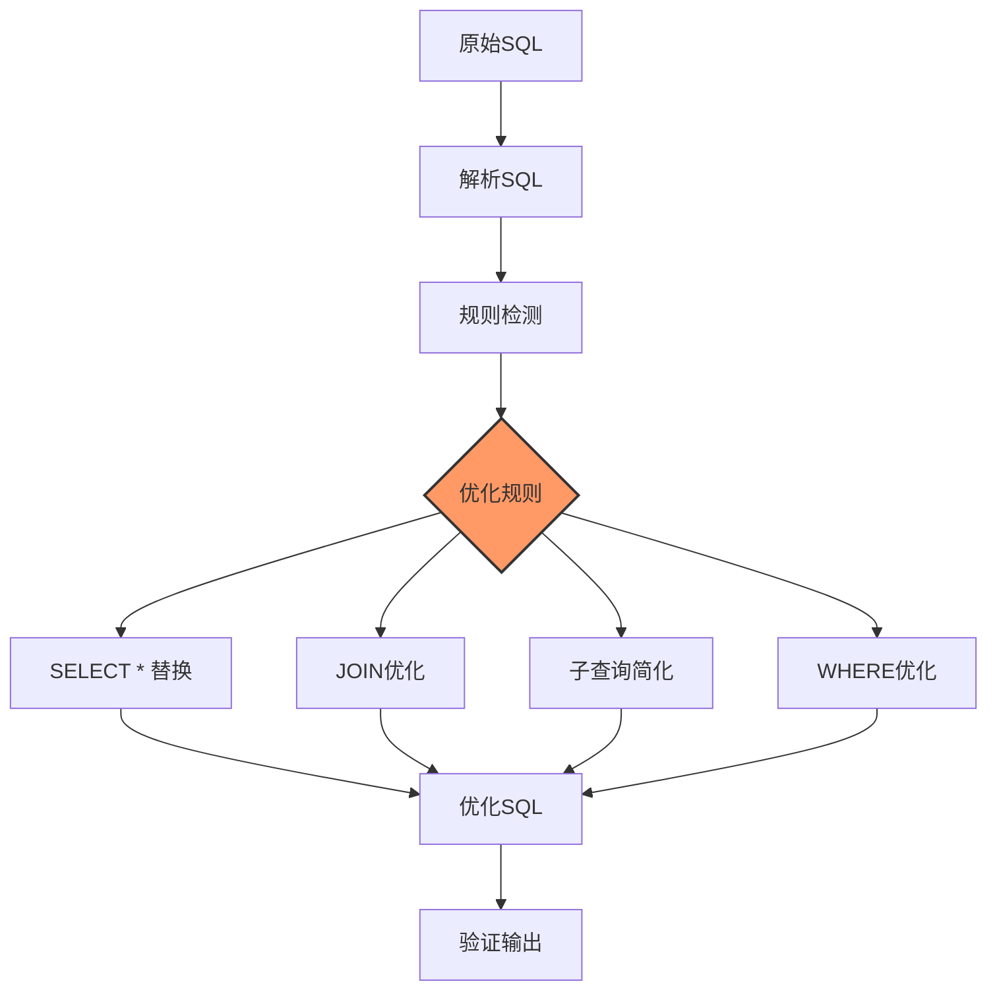
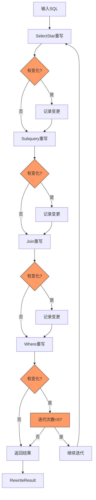

# SQL重写优化器 API 参考

## 目录

1. [概述](#1-概述)
2. [核心组件](#2-核心组件)
3. [数据模型](#3-数据模型)
4. [重写规则](#4-重写规则)
5. [执行流程](#5-执行流程)
6. [异常处理](#6-异常处理)
7. [边界条件](#7-边界条件)
8. [非功能性约束](#8-非功能性约束)

---

## 1. 概述

### 1.1 核心作用

SQL重写优化器对生成的SQL进行自动重写和优化，包括简化嵌套查询、合并重复表引用、优化WHERE条件顺序等。

### 1.2 架构图



### 1.3 组件列表

| 组件 | 类型 | 说明 |
|------|------|------|
| SelectStarRewriter | 重写规则 | SELECT * 替换为具体列 |
| SubqueryRewriter | 重写规则 | 子查询简化和展平 |
| JoinRewriter | 重写规则 | JOIN消除和重排序 |
| WhereClauseRewriter | 重写规则 | WHERE条件优化 |
| SqlRewriter | 主优化器 | 整合所有重写规则 |
| TableSchemaProvider | 接口 | 提供表结构信息 |

---

## 2. 核心组件

### 2.1 TableSchemaProvider 接口

**核心作用**：提供表结构信息，用于SELECT * 替换等优化。

#### 接口方法

| 方法 | 参数 | 返回值 | 说明 |
|------|------|--------|------|
| getSchema | tableName | TableSchema | 获取指定表的结构 |

---

### 2.2 SqlRewriter

**核心作用**：SQL重写主优化器，整合所有重写规则进行迭代优化。

#### 构造方法

| 参数 | 类型 | 说明 |
|------|------|------|
| schemaProvider | TableSchemaProvider | 表结构提供者 |

#### 核心方法

| 方法 | 参数 | 返回值 | 说明 |
|------|------|--------|------|
| rewrite | sql | RewriteResult | 执行SQL重写 |

#### 执行步骤

```
1. 接收原始SQL语句
         ↓
2. 初始化RewriteResult记录原始SQL
         ↓
3. 迭代执行重写规则（最多5次）
         ↓
4. 执行SelectStarRewriter
         ↓
5. 执行SubqueryRewriter
         ↓
6. 执行JoinRewriter
         ↓
7. 执行WhereClauseRewriter
         ↓
8. 检查是否产生变化，无变化则终止
         ↓
9. 返回RewriteResult
```

---

## 3. 数据模型

### 3.1 RewriteResult

**核心作用**：封装SQL重写的结果，包含原始SQL、优化后SQL和变更记录。

#### 字段说明

| 字段 | 类型 | 默认值 | 说明 |
|------|------|--------|------|
| originalSql | String | - | 原始SQL语句 |
| rewrittenSql | String | - | 优化后SQL语句 |
| changes | List<RewriteChange> | - | 变更记录列表 |

#### 工厂方法

| 方法 | 参数 | 说明 |
|------|------|------|
| RewriteResult | originalSql | 构造函数 |

#### 执行步骤

```
1. 接收原始SQL，初始化RewriteResult
         ↓
2. 记录每条重写规则的变更
         ↓
3. 汇总所有变更到changes列表
         ↓
4. 设置最终的rewrittenSql
         ↓
5. 返回重写结果
```

---

### 3.2 RewriteChange

**核心作用**：记录单次重写变更的详细信息。

#### 字段说明

| 字段 | 类型 | 默认值 | 说明 |
|------|------|--------|------|
| rule | String | - | 应用的规则名称 |
| before | String | - | 变更前的SQL片段 |
| after | String | - | 变更后的SQL片段 |

#### 工厂方法

| 方法 | 参数 | 说明 |
|------|------|------|
| RewriteChange | rule, before, after | 构造函数 |

---

### 3.3 JoinClause

**核心作用**：表示SQL中的JOIN子句结构。

#### 字段说明

| 字段 | 类型 | 默认值 | 说明 |
|------|------|--------|------|
| type | String | - | JOIN类型（LEFT/RIGHT/INNER等） |
| table | String | - | 表名 |
| alias | String | - | 表别名 |
| condition | String | - | JOIN条件 |

#### 工厂方法

| 方法 | 参数 | 说明 |
|------|------|------|
| JoinClause | type, table, alias, condition | 构造函数 |

---

## 4. 重写规则

### 4.1 SelectStarRewriter

**核心作用**：将 SELECT * 替换为具体的列名列表，排除大对象类型字段。

#### 构造方法

| 参数 | 类型 | 说明 |
|------|------|------|
| schemaProvider | TableSchemaProvider | 表结构提供者 |

#### 核心方法

| 方法 | 参数 | 返回值 | 说明 |
|------|------|--------|------|
| rewrite | sql, requiredColumns | String | 重写SQL |
| rewriteSelectStar | sql | String | 替换SELECT * |

#### 执行步骤

```
1. 检查SQL是否包含SELECT *
         ↓
2. 提取主表名（FROM后的表）
         ↓
3. 通过schemaProvider获取表结构
         ↓
4. 过滤大对象类型字段
         ↓
5. 生成列名字符串
         ↓
6. 替换SELECT * 为具体列名
```

#### 核心代码

```java
public String rewriteSelectStar(String sql) {
    Pattern pattern = Pattern.compile("SELECT \\*\\s+FROM\\s+(\\w+)", Pattern.CASE_INSENSITIVE);
    Matcher matcher = pattern.matcher(sql);
    
    StringBuffer result = new StringBuffer();
    while (matcher.find()) {
        String tableName = matcher.group(1);
        TableSchema schema = schemaProvider.getSchema(tableName);
        
        if (schema != null) {
            List<String> columns = schema.getColumns().stream()
                .filter(col -> !col.isLargeObject())
                .map(ColumnSchema::getName)
                .collect(Collectors.toList());
            
            matcher.appendReplacement(result, "SELECT " + String.join(", ", columns) + " FROM $1");
        }
    }
    matcher.appendTail(result);
    
    return result.toString();
}
```

---

### 4.2 SubqueryRewriter

**核心作用**：简化子查询，包括IN转EXISTS、合并嵌套子查询等。

#### 核心方法

| 方法 | 参数 | 返回值 | 说明 |
|------|------|--------|------|
| rewrite | sql | String | 执行所有子查询优化 |
| rewriteInToExists | sql | String | IN转EXISTS |
| rewriteCorrelatedSubqueries | sql | String | 简化相关子查询 |
| flattenNestedSubqueries | sql | String | 展平嵌套子查询 |

#### 执行步骤

```
【rewriteInToExists方法】
1. 匹配WHERE column IN (SELECT x FROM table)模式
         ↓
2. 提取列名和子查询信息
         ↓
3. 转换为EXISTS形式
         ↓
4. 返回优化后的SQL

【flattenNestedSubqueries方法】
1. 计算当前子查询深度
         ↓
2. 判断是否超过最大深度限制
         ↓
3. 合并相邻子查询
         ↓
4. 迭代直到深度满足要求
```

#### 核心代码

```java
public String rewriteInToExists(String sql) {
    Pattern inPattern = Pattern.compile(
        "WHERE\\s+(\\w+)\\.(\\w+)\\s+IN\\s*\\(\\s*SELECT\\s+(\\w+)\\s+FROM\\s+(\\w+)\\s*\\)",
        Pattern.CASE_INSENSITIVE
    );
    
    return inPattern.matcher(sql).replaceAll(matchResult -> {
        String column = matchResult.group(1) + "." + matchResult.group(2);
        String subColumn = matchResult.group(3);
        String subTable = matchResult.group(4);
        
        return String.format("WHERE EXISTS (SELECT 1 FROM %s WHERE %s.%s = %s)", 
            subTable, subTable, subColumn, column);
    });
}
```

---

### 4.3 JoinRewriter

**核心作用**：优化JOIN操作，消除冗余JOIN并重排序以提高性能。

#### 核心方法

| 方法 | 参数 | 返回值 | 说明 |
|------|------|--------|------|
| rewrite | sql | String | 执行所有JOIN优化 |
| eliminateRedundantJoin | sql | String | 消除冗余JOIN |
| reorderJoins | sql | String | 重排JOIN顺序 |

#### 执行步骤

```
【eliminateRedundantJoin方法】
1. 遍历SQL中的所有FROM子句
         ↓
2. 提取表名
         ↓
3. 检查是否已处理过该表
         ↓
4. 跳过重复的表引用
         ↓
5. 返回去重后的SQL

【reorderJoins方法】
1. 提取所有JOIN子句
         ↓
2. 计算每个JOIN的代价
         ↓
3. 按代价升序排序
         ↓
4. 重建SQL
```

#### 代价估算规则

| JOIN类型 | 代价权重 | 说明 |
|----------|----------|------|
| LEFT/RIGHT | +2 | 外连接代价较高 |
| LIKE/OR条件 | +3 | 复杂条件增加代价 |

---

### 4.4 WhereClauseRewriter

**核心作用**：优化WHERE子句，包括条件重排序、布尔表达式简化、条件谓词下推。

#### 核心方法

| 方法 | 参数 | 返回值 | 说明 |
|------|------|--------|------|
| rewrite | sql | String | 执行所有WHERE优化 |
| optimizeWhereOrder | sql | String | 优化条件顺序 |
| simplifyBooleanExpressions | sql | String | 简化布尔表达式 |
| pushDownConditions | sql | String | 条件下推 |

#### 执行步骤

```
【optimizeWhereOrder方法】
1. 提取WHERE子句
         ↓
2. 分割各个条件
         ↓
3. 计算每个条件的选择性分数
         ↓
4. 按分数升序排列（高选择性优先）
         ↓
5. 重组WHERE子句

【simplifyBooleanExpressions方法】
1. 移除空括号()
         ↓
2. 处理TRUE/FALSE常量
         ↓
3. 消除冗余的AND/OR操作
         ↓
4. 规范化括号嵌套
```

#### 选择性分数规则

| 条件类型 | 分数变化 | 说明 |
|----------|----------|------|
| 等值条件 (=) | -5 | 高选择性 |
| LIKE前缀 | -3 | 中等选择性 |
| 范围条件 (>/<) | -2 | 中等选择性 |
| OR条件 | +3 | 降低选择性 |
| NOT条件 | +2 | 降低选择性 |
| 函数调用 | +5 | 低选择性 |

---

## 5. 执行流程

### 5.1 完整重写流程



### 5.2 迭代控制

| 参数 | 默认值 | 说明 |
|------|--------|------|
| maxIterations | 5 | 最大迭代次数 |
| 无变化终止 | true | 检测到无变化立即终止 |

---

## 6. 异常处理

### 6.1 异常场景

| Exception | Category | Trigger Condition | Severity |
|-----------|----------|-------------------|----------|
| SQL解析失败 | Result | 无法解析SQL | HIGH |
| 表不存在 | Input | schema == null | MEDIUM |
| 无限循环 | Service | 超过最大迭代 | MEDIUM |
| 正则表达式错误 | Result | Pattern匹配失败 | LOW |

### 6.2 处理策略

| Exception | Strategy | Action | Fallback |
|-----------|----------|--------|----------|
| SQL解析失败 | Skip | 跳过当前规则 | 返回原始SQL |
| 表不存在 | Skip | 跳过SELECT*替换 | 继续其他规则 |
| 无限循环 | Break | 终止迭代 | 返回当前结果 |
| 正则表达式错误 | Catch | 记录日志 | 返回原始SQL |

---

## 7. 边界条件

| Parameter | Min | Max | Unit | Default | Handling |
|-----------|-----|-----|------|---------|----------|
| maxIterations | 1 | 10 | count | 5 | 限制最大迭代 |
| subqueryDepth | 1 | 5 | layer | 3 | 限制最大深度 |
| maxJoinCount | 1 | 20 | count | 10 | 警告超出 |
| maxConditionCount | 1 | 50 | count | 30 | 限制条件数 |
| tableAliasLength | 1 | 30 | char | 20 | 截断过长别名 |

---

## 8. 非功能性约束

### 8.1 性能指标

| 指标 | 目标值 | 说明 |
|------|--------|------|
| 重写延迟 | ≤50ms | 单条SQL重写时间 |
| 性能提升 | ≥20% | 重写后vs重写前执行效率 |
| 准确率 | ≥95% | 重写正确性比例 |
| 迭代效率 | ≤5次 | 平均迭代次数 |

### 8.2 优化效果

| 优化类型 | 预期效果 | 适用场景 |
|----------|----------|----------|
| SELECT * 替换 | 减少数据传输 | 包含大对象字段 |
| IN转EXISTS | 提高查询速度 | IN子句含子查询 |
| JOIN消除 | 减少扫描次数 | 冗余表引用 |
| WHERE重排序 | 加速过滤 | 多条件AND连接 |

---

## 附录：优缺点分析

### 优点

- 自动优化，无需人工干预
- 可配置优化规则和参数
- 保持SQL语义等价性
- 支持多轮迭代优化
- 完整的变更追踪

### 缺点

- 规则覆盖可能不全面
- 复杂SQL可能优化失败
- 需要准确的Schema信息
- 正则匹配可能有边界情况
