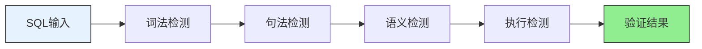

# SQL Validation 文档索引

本目录包含 SQL 语法验证各层次的详细文档。

## 文档列表

| 文档 | 检测层次 | 说明 |
|------|----------|------|
| [lexical-validation.md](lexical-validation.md) | 词法检测 | Token级别验证、关键字/标识符检查 |
| [syntactic-validation.md](syntactic-validation.md) | 句法检测 | 结构级别验证、子句完整性检查 |
| [semantic-validation.md](semantic-validation.md) | 语义检测 | 含义级别验证、表/列存在性检查 |
| [execution-validation.md](execution-validation.md) | 执行检测 | 运行级别验证、执行计划分析 |

## 验证层次概览

| 层次 | 说明 | 核心功能 |
|------|------|----------|
| **词法检测** | Token级别验证 | 关键字、标识符、运算符正确性 |
| **句法检测** | 结构级别验证 | 子句完整性、括号匹配、关键字顺序 |
| **语义检测** | 含义级别验证 | 表/列存在性、数据类型兼容性 |
| **执行检测** | 运行级别验证 | 执行计划、性能评估、试执行 |

## 架构流程



## 快速开始

```java
ValidationPipeline pipeline = new ValidationPipeline(
    "mysql",
    schema,
    connection
);

ValidationResult result = pipeline.execute("SELECT * FROM users WHERE id = 1");
System.out.println(result.isValid());
```

## 依赖

```xml
<!-- Maven -->
<dependency>
    <groupId>org.antlr</groupId>
    <artifactId>antlr4-runtime</artifactId>
    <version>4.12.0</version>
</dependency>
```
