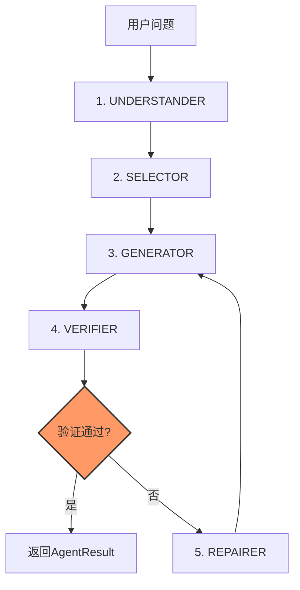
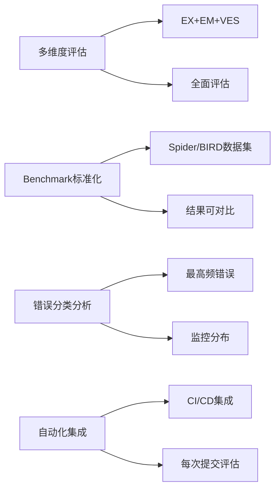
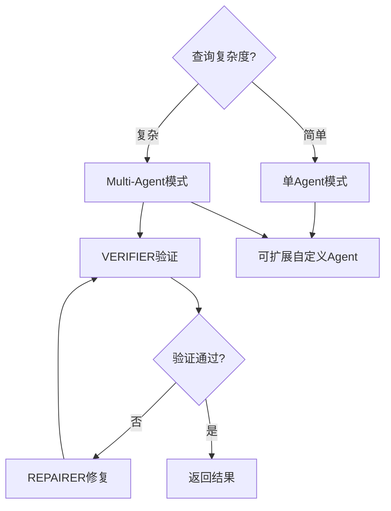
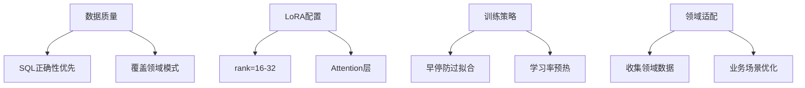
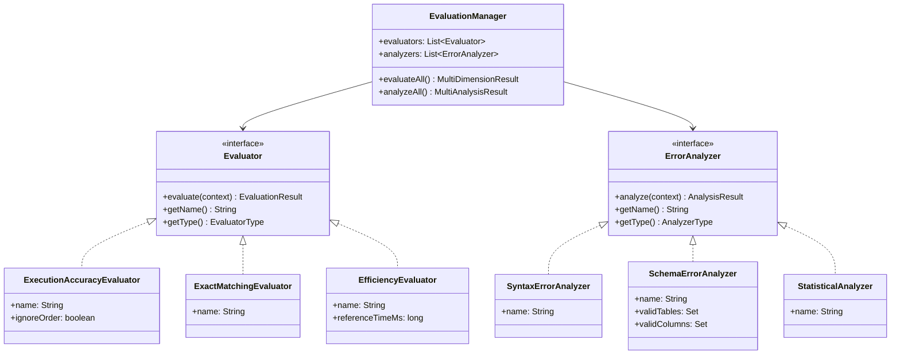

# Text2SQL 高级特性

## 文档索引

| 文档 | 说明 |
|------|------|
| [text2sql-guide.md](../text2sql-guide.md) | 核心指南，包含基础流程 |
| [text2sql-api.md](../text2sql-api.md) | API参考 |
| [docs/schema-linking/](../docs/schema-linking/) | 模式对齐详细文档 |
| [docs/sql-validation/](../docs/sql-validation/) | SQL语法检测详细文档 |
| [docs/sql-optimization/](../docs/sql-optimization/) | 查询效率优化详细文档 |

## 目录

1. [语义理解增强](#1-语义理解增强)
2. [模式对齐高级](#2-模式对齐高级)
3. [评估体系](#3-评估体系)
4. [错误分析](#4-错误分析)
5. [Multi-Agent框架](#5-multi-agent框架)
6. [Fine-tuning训练](#6-fine-tuning训练)

---

## 1. 语义理解增强

### 1.1 歧义处理策略

**核心作用**：高级语义理解，处理自然语言中的歧义和模糊表达。

#### 歧义类型与策略

| 歧义类型 | 示例 | 检测方法 | 默认处理策略 |
|----------|------|----------|--------------|
| 时间歧义 | "最新数据" | 时间关键词检测 | ORDER BY time DESC |
| 数量歧义 | "大部分用户" | 量化词检测 | 默认前80% |
| 排序歧义 | "最好的产品" | 排序关键词检测 | 综合评分降序 |
| 范围歧义 | "近期订单" | 时间范围检测 | 最近30天 |

#### 执行步骤

```
1. 歧义词识别
   • 正则表达式匹配时间词：最新、最近、近期
   • 量化词检测：大部分、少数、全部
   • 排序词检测：最好、最高、第一名
         ↓
2. 上下文推断
   • 对话历史分析
   • 同一会话中的指代消解
   • 主题一致性判断
         ↓
3. 默认策略应用
   • 时间最新 → 创建时间降序
   • 数量最多 → COUNT降序
   • 评分最高 → score降序
         ↓
4. 用户确认（可选）
   • 生成多选问题
   • 获取用户反馈
   • 更新上下文
```

---

### 1.2 语义嵌入匹配

**核心作用**：使用语义嵌入技术实现自然语言与Schema的语义对齐。

#### 嵌入方法

| 方法 | 说明 | 适用场景 |
|------|------|----------|
| **Sentence-BERT** | 句子级别嵌入 | 问句vs表注释 |
| **USE** | 通用句子编码器 | 快速语义匹配 |
| **BGE** | 中文优化的嵌入 | 中文Schema匹配 |
| **ColBERT** | 细粒度嵌入 | 列名匹配 |

#### 执行步骤

```
1. Schema嵌入生成
   • 表名嵌入：table_name + table_comment
   • 列名嵌入：column_name + column_comment
   • 描述嵌入：业务描述文本
         ↓
2. 问句嵌入
   • 用户问题整体嵌入
   • 关键词片段嵌入
         ↓
3. 相似度计算
   • 余弦相似度
   • 语义相似度分数
         ↓
4. 阈值过滤
   • 设置相似度阈值（如0.7）
   • 过滤低相关Schema元素
         ↓
5. 排序输出
   • 按相似度降序
   • 保留Top-K相关元素
```

---

## 2. 模式对齐高级

### 2.1 混合匹配策略

**核心作用**：结合字符串匹配和语义匹配，实现更准确的Schema对齐。

详细实现见 [Schema Linking 文档索引](../docs/schema-linking/README.md)：

| 方法 | 详细文档 |
|------|----------|
| [字符串匹配](../docs/schema-linking/string-match.md) | Levenshtein、Jaccard相似度 |
| [语义嵌入](../docs/schema-linking/semantic-embed.md) | Sentence-BERT、USE、BGE |
| [联合学习](../docs/schema-linking/joint-learning.md) | RATSQL、GNN |
| [关系推断](../docs/schema-linking/relation-inference.md) | 外键推断、JOIN路径生成 |

#### 匹配策略组合

| 策略 | 权重 | 说明 |
|------|------|------|
| 字符串精确匹配 | 0.4 | 表名/列名完全匹配 |
| 字符串模糊匹配 | 0.2 | Levenshtein相似度 |
| 语义嵌入匹配 | 0.3 | Sentence-BERT相似度 |
| 关系匹配 | 0.1 | 外键关系推断 |

#### 执行步骤

```
1. 字符串精确匹配
   • 表名完全匹配
   • 列名完全匹配
   • 注释完全匹配
         ↓
2. 字符串模糊匹配
   • Levenshtein距离计算
   • Jaccard相似度
   • 阈值过滤（>0.8）
         ↓
3. 语义嵌入匹配
   • 生成Schema嵌入
   • 生成问句嵌入
   • 计算语义相似度
         ↓
4. 关系推断
   • 外键关系分析
   • JOIN路径推断
   • 自动补充关联表
         ↓
5. 综合排序
   • 加权分数计算
   • 最终排序输出
```

---

### 2.2 外键关系推断

**核心作用**：自动推断表之间的外键关系，辅助JOIN生成。

详细实现见 [关系推断文档](../docs/schema-linking/relation-inference.md)。

#### 关系类型

| 关系类型 | 说明 | 推断方法 |
|----------|------|----------|
| **一对一** | 主键-外键唯一约束 | 唯一性约束检测 |
| **一对多** | 主键-外键 | 外键关系分析 |
| **多对多** | 中间表关联 | 三表关系推断 |

#### 执行步骤

```
1. 外键信息提取
   • 从INFORMATION_SCHEMA读取
   • 解析CREATE TABLE语句
   • 识别显式外键约束
         ↓
2. 隐式关系推断
   • 列名相似度检测
   • 类型匹配分析
   • 命名规范识别
         ↓
3. JOIN路径生成
   • 最短路径搜索
   • 中间表检测
   • 多跳关系构建
         ↓
4. 验证与优化
   • 关系有效性验证
   • 消除冗余路径
   • 性能评估
```

---

## 3. 评估体系

### 3.1 评估指标

**核心作用**：定义Text2SQL系统的多维度评估指标体系。

| 指标 | 说明 | 计算公式 |
|------|------|----------|
| **EX** | 执行准确率 | 预测结果==标准结果的比例 |
| **EM** | 精确匹配率 | SQL完全匹配的比例 |
| **VES** | 有效效率分数 | EX × Efficiency_Score |

---

### 3.2 Evaluator接口

**核心作用**：定义评估器的统一接口，支持多维度评估，不同评估器可插拔。

#### 接口方法

| 方法 | 参数 | 返回值 | 说明 |
|------|------|--------|------|
| evaluate | context | EvaluationResult | 执行评估 |
| getName | - | String | 获取评估器名称 |
| getType | - | EvaluatorType | 获取评估器类型 |

#### 评估器类型

| 枚举值 | 说明 |
|--------|------|
| EXECUTION_ACCURACY | 执行准确率评估 |
| EXACT_MATCHING | 精确匹配评估 |
| EFFICIENCY | 效率评估 |
| SEMANTIC_SIMILARITY | 语义相似度评估 |
| CUSTOM | 自定义评估 |

#### 执行步骤

```
1. 接收EvaluationContext上下文
         ↓
2. 遍历测试集中的每个样本
         ↓
3. 对每个样本执行具体的评估逻辑
         ↓
4. 统计正确/错误数量
         ↓
5. 计算评估分数
         ↓
6. 返回EvaluationResult
```

---

### 3.3 EvaluationContext

**核心作用**：封装评估所需的上下文信息，包含测试集、配置和基准信息。

#### 字段说明

| 字段 | 类型 | 说明 |
|------|------|------|
| testSet | List<EvaluationExample> | 测试集 |
| config | Map<String, String> | 评估配置 |
| benchmark | String | Benchmark名称 |
| referenceTimeMs | long | 参考时间(ms) |

#### 嵌套类：EvaluationExample

| 字段 | 类型 | 说明 |
|------|------|------|
| question | String | 问题 |
| dbId | String | 数据库ID |
| goldSQL | String | 标准SQL |
| goldResult | List<Map<String, Object>> | 标准结果 |
| predictedSQL | String | 预测SQL |
| predictedResult | List<Map<String, Object>> | 预测结果 |
| executionTimeMs | long | 执行时间 |

#### 执行步骤

```
1. 构建测试集（EvaluationExample列表）
         ↓
2. 设置评估配置（指标开关、阈值等）
         ↓
3. 指定Benchmark（Spider/BIRD等）
         ↓
4. 设置参考时间（用于VES计算）
         ↓
5. 传入Evaluator执行评估
```

---

### 3.4 ExecutionAccuracyEvaluator

**核心作用**：执行准确率评估器（EX），比较SQL执行结果是否一致。

#### 字段说明

| 字段 | 类型 | 默认值 | 说明 |
|------|------|--------|------|
| name | String | 执行准确率评估器 | 评估器名称 |
| ignoreOrder | boolean | true | 是否忽略结果顺序 |

#### 执行步骤

```
1. 遍历测试集中的每个样本
         ↓
2. 比较predictedResult和goldResult
         ↓
3. 如果ignoreOrder=true：
   - 将结果转换为Set（忽略顺序）
   - 比较两个Set是否相等
         ↓
4. 如果ignoreOrder=false：
   - 按顺序逐行比较
         ↓
5. 统计正确数量
         ↓
6. 计算准确率 = 正确数/总数 × 100%
         ↓
7. 记录错误案例
```

---

### 3.5 ExactMatchingEvaluator

**核心作用**：精确匹配评估器（EM），比较SQL语句是否完全匹配。

#### 字段说明

| 字段 | 类型 | 默认值 | 说明 |
|------|------|--------|------|
| name | String | 精确匹配评估器 | 评估器名称 |

#### 执行步骤

```
1. 遍历测试集中的每个样本
         ↓
2. 规范化predictedSQL和goldSQL：
   - 转小写
   - 合并多余空格
   - 标准化标点符号
         ↓
3. 比较规范化后的SQL是否完全相等
         ↓
4. 统计匹配数量
         ↓
5. 计算匹配率 = 匹配数/总数 × 100%
```

---

### 3.6 EfficiencyEvaluator

**核心作用**：效率评估器（VES），综合考虑准确性和执行效率。

#### 字段说明

| 字段 | 类型 | 默认值 | 说明 |
|------|------|--------|------|
| name | String | 效率评估器 | 评估器名称 |
| referenceTimeMs | long | 5000 | 参考时间(ms) |

#### 执行步骤

```
1. 遍历测试集中的每个样本
         ↓
2. 检查预测结果是否正确
         ↓
3. 计算效率分数：
   efficiency = min(1.0, referenceTime / actualTime)
         ↓
4. 如果结果不正确，efficiency = 0
         ↓
5. 计算VES = Σ(correct × efficiency) / 总数 × 100%
```

---

### 3.7 EvaluationResult

**核心作用**：封装评估结果，包含分数、统计信息和错误案例。

#### 字段说明

| 字段 | 类型 | 说明 |
|------|------|------|
| evaluatorName | String | 评估器名称 |
| score | double | 评估分数 |
| correctCount | int | 正确数量 |
| totalCount | int | 总数量 |
| errors | List<ErrorCase> | 错误案例列表 |

#### 嵌套类：ErrorCase

| 字段 | 类型 | 说明 |
|------|------|------|
| question | String | 问题 |
| goldSQL | String | 标准SQL |
| predictedSQL | String | 预测SQL |
| errorType | String | 错误类型 |

---

### 3.8 EvaluationManager

**核心作用**：综合评估管理器，支持多维度评估和结果聚合。

#### 执行步骤

```
1. 注册多个Evaluator（可自定义）
         ↓
2. 设置EvaluationContext
         ↓
3. 调用evaluateAll()：
   - 遍历所有已注册的Evaluator
   - 收集每个Evaluator的评估结果
   - 聚合结果到MultiDimensionResult
         ↓
4. 可选择性调用evaluate(EvaluatorType)：
   - 执行指定类型的评估器
   - 返回单一评估结果
```

---

## 4. 错误分析

### 4.1 错误分类

**核心作用**：定义SQL错误的分类体系，便于问题定位和优化。

| 错误类型 | 说明 | 严重级别 |
|----------|------|----------|
| SYNTAX_ERROR | SQL语法错误 | CRITICAL |
| SCHEMA_ERROR | Schema引用错误 | HIGH |
| SEMANTIC_ERROR | 语义不匹配 | MEDIUM |
| LOGIC_ERROR | 逻辑错误 | MEDIUM |
| EMPTY_RESULT | 空结果 | LOW |

---

### 4.2 ErrorAnalyzer接口

**核心作用**：定义错误分析器的统一接口，支持多维度错误分析。

#### 接口方法

| 方法 | 参数 | 返回值 | 说明 |
|------|------|--------|------|
| analyze | context | AnalysisResult | 执行分析 |
| getName | - | String | 获取分析器名称 |
| getType | - | AnalyzerType | 获取分析器类型 |

#### 分析器类型

| 枚举值 | 说明 |
|--------|------|
| SYNTAX | 语法错误分析 |
| SCHEMA | Schema错误分析 |
| SEMANTIC | 语义错误分析 |
| STATISTICAL | 统计分析 |
| ROOT_CAUSE | 根因分析 |
| CUSTOM | 自定义分析 |

#### 执行步骤

```
1. 接收ErrorContext上下文
         ↓
2. 筛选对应类型的错误
         ↓
3. 执行统计分析或模式检测
         ↓
4. 识别错误模式和分布
         ↓
5. 生成AnalysisResult
```

---

### 4.3 ErrorContext

**核心作用**：封装错误分析所需的上下文信息。

#### 字段说明

| 字段 | 类型 | 说明 |
|------|------|------|
| errors | List<ErrorRecord> | 错误记录列表 |
| config | Map<String, String> | 分析配置 |
| benchmark | String | Benchmark名称 |

#### 嵌套类：ErrorRecord

| 字段 | 类型 | 说明 |
|------|------|------|
| question | String | 问题 |
| predictedSQL | String | 预测SQL |
| goldSQL | String | 标准SQL |
| errorType | String | 错误类型 |
| errorMessage | String | 错误信息 |
| rootCause | String | 根因 |
| timestamp | long | 时间戳 |

---

### 4.4 SyntaxErrorAnalyzer

**核心作用**：语法错误分析器，检测和分类SQL语法错误。

#### 字段说明

| 字段 | 类型 | 默认值 | 说明 |
|------|------|--------|------|
| name | String | 语法错误分析器 | 分析器名称 |

#### 执行步骤

```
1. 遍历错误列表，筛选SYNTAX_ERROR类型
         ↓
2. 检测语法错误模式：
   - 括号不匹配
   - FROM子句错误
   - SELECT子句错误
   - WHERE子句错误
         ↓
3. 统计各模式的数量
         ↓
4. 生成错误详情列表
         ↓
5. 返回AnalysisResult
```

---

### 4.5 SchemaErrorAnalyzer

**核心作用**：Schema错误分析器，检测表/列引用错误。

#### 字段说明

| 字段 | 类型 | 默认值 | 说明 |
|------|------|--------|------|
| name | String | Schema错误分析器 | 分析器名称 |
| validTables | Set<String> | - | 有效表名集合 |
| validColumns | Set<String> | - | 有效列名集合 |

#### 执行步骤

```
1. 遍历错误列表，筛选SCHEMA_ERROR类型
         ↓
2. 提取SQL中引用的表和列
         ↓
3. 与有效Schema进行比较
         ↓
4. 检测错误模式：
   - JOIN错误
   - 表引用错误
   - 列引用错误
         ↓
5. 统计各模式的数量
         ↓
6. 生成AnalysisResult
```

---

### 4.6 StatisticalAnalyzer

**核心作用**：统计分析器，进行多维度统计分析。

#### 字段说明

| 字段 | 类型 | 默认值 | 说明 |
|------|------|--------|------|
| name | String | 统计分析器 | 分析器名称 |

#### 执行步骤

```
1. 统计各错误类型的分布
         ↓
2. 计算各类型的占比（百分比）
         ↓
3. 识别最常见的错误类型
         ↓
4. 按问题分组统计
         ↓
5. 生成统计分析报告
```

---

### 4.7 AnalysisResult

**核心作用**：封装分析结果，包含分布统计和错误详情。

#### 字段说明

| 字段 | 类型 | 说明 |
|------|------|------|
| analyzerName | String | 分析器名称 |
| type | AnalyzerType | 分析器类型 |
| distribution | Map<String, Integer> | 错误分布 |
| details | List<ErrorDetail> | 错误详情列表 |
| percentages | Map<String, Double> | 百分比分布 |
| mostCommonType | String | 最常见错误类型 |

#### 嵌套类：ErrorDetail

| 字段 | 类型 | 说明 |
|------|------|------|
| question | String | 问题 |
| sql | String | SQL语句 |
| pattern | String | 错误模式 |
| description | String | 描述 |

---

### 4.8 ErrorAnalysisManager

**核心作用**：综合错误分析管理器，支持多维度分析和结果聚合。

#### 执行步骤

```
1. 注册多个ErrorAnalyzer（可自定义）
         ↓
2. 设置ErrorContext
         ↓
3. 调用analyzeAll()：
   - 遍历所有已注册的Analyzer
   - 收集每个Analyzer的分析结果
   - 聚合结果到MultiAnalysisResult
         ↓
4. 可选择性调用analyze(AnalyzerType)：
   - 执行指定类型的分析器
   - 返回单一分析结果
```

---

## 5. Multi-Agent框架

### 5.1 Agent类型

**核心作用**：定义Multi-Agent框架中的Agent角色分工。

| Agent | 职责 |
|-------|------|
| UNDERSTANDER | 理解查询意图 |
| SELECTOR | 选择相关表和列 |
| GENERATOR | 生成SQL语句 |
| VERIFIER | 验证SQL正确性 |
| REPAIRER | 修复错误的SQL |

---

### 5.2 AgentOrchestrator

**核心作用**：Agent协调器，协调多个Agent协作完成复杂Text2SQL任务。

#### 核心方法

| 方法 | 参数 | 返回值 | 说明 |
|------|------|--------|------|
| execute | question | AgentResult | 执行Agent协作 |
| executeAgent | type, input | String | 执行单个Agent |
| understandIntent | question | String | 理解意图 |
| selectSchema | intent | String | 选择Schema |
| generateSQL | context | String | 生成SQL |
| verify | sql | boolean | 验证SQL |
| repair | sql, intent | String | 修复SQL |

#### AgentResult字段

| 字段 | 类型 | 说明 |
|------|------|------|
| success | boolean | 是否成功 |
| sql | String | 生成的SQL |
| status | String | 状态信息 |

#### 执行步骤



### Node: Agent Orchestrator

**Node Responsibilities**
- 协调多个Agent完成复杂Text2SQL任务
- 管理任务分解、结果聚合、流程控制

**Input Parameters**
| Parameter | Type | Format | Required | Description |
|-----------|------|--------|----------|-------------|
| question | String | Text | Yes | 用户问题 |

**Output Specification**
| Field | Type | Format | Description |
|-------|------|--------|-------------|
| success | boolean | JSON | 是否成功 |
| sql | String | Text | 生成的SQL |
| status | String | Text | 状态信息 |

**Constraints**
| Type | Requirement | Value |
|------|-------------|-------|
| Performance | Latency P95 | ≤3s |
| Performance | Retry Limit | ≤3次 |
| Environment | Online | Yes |

**Key Logic**
- Agent类型：UNDERSTANDER/SELECTOR/GENERATOR/VERIFIER/REPAIRER
- 验证失败时自动调用REPAIRER修复
- 修复循环最多3次

**Dependencies**
| Resource | Type | Description |
|----------|------|-------------|
| LLMClient | REST API | 多个Agent共享 |
| DatabaseOperations | JDBC | Schema获取 |
| SQLSecurityValidator | Internal | SQL验证 |

---

## 6. Fine-tuning训练

### 6.1 TrainingData

**核心作用**：封装训练数据格式，支持多种数据源导入。

#### 嵌套类：TrainingExample

| 字段 | 类型 | 说明 |
|------|------|------|
| instruction | String | 指令 |
| input | String | 输入 |
| output | String | 输出（SQL） |

#### 执行步骤

```
1. 构建TrainingExample列表
         ↓
2. 转换数据格式（可选）：
   - Instruction格式
   - ChatML格式
   - JSONL格式
         ↓
3. 数据清洗（过滤无效样本）
         ↓
4. 数据增强（可选）：
   - 同义词替换
   - 问题改写
         ↓
5. 导出为训练文件
```

---

### 6.2 LoRAConfig

**核心作用**：LoRA微调配置，参数高效微调的参数设置。

#### 字段说明

| 字段 | 类型 | 默认值 | 说明 |
|------|------|--------|------|
| rank | int | 16 | LoRA秩 |
| alpha | float | 32 | 缩放因子 |
| targetModules | String | q_proj,v_proj | 目标模块 |
| dropout | float | 0.05 | Dropout率 |

#### 执行步骤

```
1. 设置LoRA秩（rank）：
   - 常用值：8/16/32/64
   - 越大效果越好，但训练越慢
         ↓
2. 设置缩放因子（alpha）：
   - 推荐值：2 × rank
         ↓
3. 选择目标模块（targetModules）：
   - 推荐：q_proj,v_proj,k_proj,o_proj
         ↓
4. 设置Dropout防止过拟合
```

---

### 6.3 FineTuningConfig

**核心作用**：微调训练配置，包含模型和训练超参数。

#### 字段说明

| 字段 | 类型 | 默认值 | 说明 |
|------|------|--------|------|
| baseModel | String | Qwen/Qwen2-7B | 基础模型 |
| learningRate | double | 2e-4 | 学习率 |
| batchSize | int | 4 | 批次大小 |
| epochs | int | 3 | 训练轮数 |
| warmupSteps | int | 100 | 预热步数 |
| maxSeqLength | int | 512 | 最大序列长度 |
| lora | LoRAConfig | - | LoRA配置 |

#### 执行步骤

```
1. 选择基础模型（baseModel）：
   - 7B/13B/70B等
         ↓
2. 设置训练超参数：
   - learningRate：推荐2e-4
   - batchSize：根据显存调整
   - epochs：通常3-5轮
         ↓
3. 配置LoRA参数
         ↓
4. 准备训练数据
         ↓
5. 执行训练
         ↓
6. 保存LoRA权重
```

---

## 7. 最佳实践总结

### 7.1 评估最佳实践



### 7.2 Multi-Agent最佳实践



### 7.3 Fine-tuning最佳实践



---

## 8. 异常处理与边界条件

### 8.1 异常场景

| Exception | Category | Trigger | Severity |
|-----------|----------|---------|----------|
| 评估指标为NaN | Result | score = NaN | HIGH |
| 训练Loss不收敛 | Service | loss持续上升 | MEDIUM |
| 数据格式错误 | Input | JSON解析失败 | HIGH |
| 模型加载失败 | Service | model = null | CRITICAL |
| 评估超时 | Service | time > 300s | HIGH |

### 8.2 处理策略

| Exception | Strategy | Action | Fallback |
|-----------|----------|--------|----------|
| 评估指标为NaN | Skip | 跳过该样本 | 记录日志 |
| 训练Loss不收敛 | EarlyStop | 停止训练 | 回退到上一个checkpoint |
| 数据格式错误 | Skip | 跳过该样本 | 记录错误 |
| 模型加载失败 | Retry | 重试3次 | 返回错误 |
| 评估超时 | Cancel | 终止评估 | 返回超时错误 |

### 8.3 边界条件

| Parameter | Min | Max | Unit | Handling |
|-----------|-----|-----|------|----------|
| 训练轮数 | 1 | 100 | epoch | 限制范围 |
| batchSize | 1 | 128 | sample | 限制显存 |
| LoRA rank | 4 | 128 | dimension | 限制范围 |
| 学习率 | 1e-6 | 1e-2 | float | 限制范围 |
| 序列长度 | 32 | 2048 | token | 截断处理 |
| 测试集大小 | 1 | 10000 | sample | 分批处理 |

---

## 9. 非功能性约束

| 指标 | 目标值 | 说明 |
|------|--------|------|
| **评估响应时间** | P95≤2秒 | 单次评估P95响应时间 |
| **训练时间** | ≤24小时 | 单次完整训练时长 |
| **模型大小** | ≤7B参数 | LoRA微调后模型 |
| **准确率** | EX≥85% | 执行准确率目标 |
| **评估吞吐量** | ≥10 samples/s | 每秒处理样本数 |
| **错误分类准确率** | ≥90% | 错误分类正确率 |

### Multi-Agent性能指标

| 指标 | 目标值 | 说明 |
|------|--------|------|
| **P95响应时间** | ≤3秒 | 复杂查询P95响应时间 |
| **修复成功率** | ≥70% | VERIFIER失败后REPAIRER修复成功率 |
| **最大Agent数** | 10 | 单次任务最大Agent调用数 |

### Fine-tuning性能指标

| 指标 | 目标值 | 说明 |
|------|--------|------|
| **训练速度** | ≥100 steps/s | 训练步数/秒 |
| **显存占用** | ≤24GB | 单卡最大显存使用 |
| **收敛epoch** | ≤10 | 达到目标准确率的epoch数 |

---

## 附录：类图


