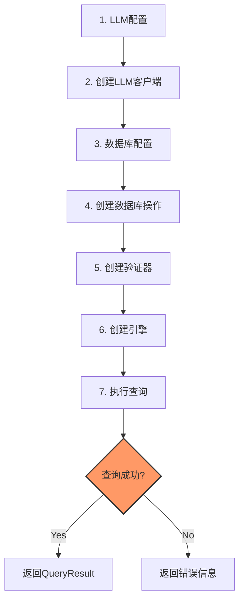

# Text2SQL API 参考

## 目录

1. [配置类](#1-配置类)
2. [数据模型](#2-数据模型)
3. [LLM客户端](#3-llm客户端)
4. [数据库操作](#4-数据库操作)
5. [验证器](#5-验证器)
6. [枚举类型](#6-枚举类型)
7. [快速使用流程](#7-快速使用流程)
8. [异常处理](#8-异常处理)
9. [非功能性约束](#9-非功能性约束)

---

## 1. 配置类

### 1.1 LLMConfig

**核心作用**：配置LLM大模型，提供多种大模型的一键配置和客户端创建能力。

#### 字段说明

| 字段 | 类型 | 默认值 | 说明 |
|------|------|--------|------|
| provider | String | - | 提供商：minimax/qwen/openai/local |
| apiKey | String | - | API密钥 |
| model | String | - | 模型名称 |
| baseUrl | String | - | API地址 |
| temperature | double | 0.1 | 温度参数 |
| maxTokens | int | 2000 | 最大token数 |
| timeout | int | 60000 | 超时时间(ms) |

#### 工厂方法

| 方法 | 参数 | 说明 |
|------|------|------|
| forMiniMax | apiKey | MiniMax-Text-01 (2.7B) - 推荐用于Text2SQL |
| forQwen | apiKey | 通义千问配置 |
| forOpenAI | apiKey, model | OpenAI配置 |
| forLocal | baseUrl, model | 本地模型配置 |
| createClient | - | 创建LLM客户端实例 |

#### 执行步骤

```
1. 选择LLM提供商（MiniMax/通义千问/OpenAI/本地）
         ↓
2. 调用对应的工厂方法（forXxx）
         ↓
3. 设置API密钥和模型参数
         ↓
4. 调用createClient()创建客户端
         ↓
5. 使用客户端进行LLM调用
```

---

### 1.2 DatabaseConfig

**核心作用**：配置数据库连接信息，支持多种关系型数据库。

#### 字段说明

| 字段 | 类型 | 默认值 | 说明 |
|------|------|--------|------|
| type | DatabaseType | - | 数据库类型 |
| host | String | - | 主机地址 |
| port | int | - | 端口 |
| database | String | - | 数据库名 |
| username | String | - | 用户名 |
| password | String | - | 密码 |
| maxConnections | int | 10 | 最大连接数 |
| timeout | int | 30000 | 超时时间(ms) |

#### 工厂方法

| 方法 | 参数 | 说明 |
|------|------|------|
| createMySQL | host, port, database, user, pwd | 创建MySQL配置 |
| createSQLite | dbPath | 创建SQLite配置 |

#### 执行步骤

```
1. 选择数据库类型（MySQL/PostgreSQL/SQLite等）
         ↓
2. 调用对应的工厂方法（createXxx）
         ↓
3. 设置连接参数（主机、端口、数据库名）
         ↓
4. 设置认证信息（用户名、密码）
         ↓
5. 创建DatabaseOperations实现类（如MySQLOperations）
```

---

### 1.3 Text2SQLConfig

**核心作用**：配置Text2SQL引擎的运行参数，控制验证和Schema Linking行为。

#### 字段说明

| 字段 | 类型 | 默认值 | 说明 |
|------|------|--------|------|
| database | DatabaseConfig | - | 数据库配置 |
| llm | LLMConfig | - | LLM配置 |
| enableSQLValidation | boolean | true | 启用SQL验证 |
| enableSchemaValidation | boolean | true | 启用Schema验证 |
| allowedTables | List<String> | - | 允许访问的表 |
| systemPrompt | String | - | 系统提示词 |
| enableSchemaLinking | boolean | true | 启用Schema Linking |
| maxRelevantTables | int | 10 | 最大相关表数量 |

#### 执行步骤

```
1. 配置数据库连接（database字段）
         ↓
2. 配置LLM大模型（llm字段）
         ↓
3. 配置验证开关（enableSQLValidation等）
         ↓
4. 配置访问控制（allowedTables限制表）
         ↓
5. 配置Schema Linking参数（maxRelevantTables）
         ↓
6. 传入Text2SQLEngine使用
```

---

## 2. 数据模型

### 2.1 TableSchema

**核心作用**：表示数据库表的结构信息，包含表名、列定义、主键和外键关系。

#### 字段说明

| 字段 | 类型 | 默认值 | 说明 |
|------|------|--------|------|
| tableName | String | - | 表名 |
| comment | String | - | 表注释 |
| columns | List<ColumnSchema> | - | 列定义 |
| primaryKeys | List<String> | - | 主键列表 |
| foreignKeys | List<ForeignKey> | - | 外键列表 |

#### 嵌套类：ForeignKey

| 字段 | 类型 | 说明 |
|------|------|------|
| column | String | 外键列名 |
| referencedTable | String | 引用的表 |
| referencedColumn | String | 引用的列 |

#### 执行步骤

```
1. 从DatabaseOperations获取表名列表（getAllTables）
         ↓
2. 对每个表调用getTableSchema获取结构
         ↓
3. 解析列信息（ColumnSchema）
         ↓
4. 解析主键（primaryKeys）
         ↓
5. 解析外键关系（foreignKeys）
         ↓
6. 构建Schema描述供LLM使用
```

---

### 2.2 ColumnSchema

**核心作用**：表示数据表列的元信息，包含列名、类型、约束等。

#### 字段说明

| 字段 | 类型 | 默认值 | 说明 |
|------|------|--------|------|
| name | String | - | 列名 |
| type | String | - | 数据类型 |
| comment | String | - | 列注释 |
| nullable | boolean | true | 是否可空 |
| primaryKey | boolean | false | 是否主键 |
| foreignKey | boolean | false | 是否外键 |
| defaultValue | String | - | 默认值 |
| referencedTable | String | - | 引用的表（外键时） |
| referencedColumn | String | - | 引用的列（外键时） |

#### 执行步骤

```
1. 从数据库INFORMATION_SCHEMA读取列信息
         ↓
2. 解析列名和数据类型
         ↓
3. 判断约束（主键、外键、可空）
         ↓
4. 获取列注释和默认值
         ↓
5. 构建ColumnSchema对象
```

---

### 2.3 QueryResult

**核心作用**：封装SQL查询的执行结果，包含数据、执行状态和性能信息。

#### 字段说明

| 字段 | 类型 | 默认值 | 说明 |
|------|------|--------|------|
| success | boolean | - | 是否成功 |
| data | List<Map<String, Object>> | - | 结果数据 |
| executionTimeMs | long | - | 执行时间(ms) |
| rowCount | int | - | 结果行数 |
| sql | String | - | 执行的SQL |
| errorMessage | String | - | 错误信息 |

#### 工厂方法

| 方法 | 参数 | 说明 |
|------|------|------|
| success | data, executionTime, sql | 创建成功结果 |
| error | message, sql | 创建错误结果 |

#### 执行步骤

```
1. 执行SQL查询（Statement.executeQuery）
         ↓
2. 记录开始时间
         ↓
3. 将ResultSet转换为List<Map>
         ↓
4. 计算执行时间
         ↓
5. 判断是否成功，生成对应的QueryResult
```

---

### 2.4 FunctionDefinition

**核心作用**：定义Function Calling的函数签名，用于LLM生成结构化输出。

#### 字段说明

| 字段 | 类型 | 默认值 | 说明 |
|------|------|--------|------|
| name | String | - | 函数名 |
| description | String | - | 函数描述 |
| parameters | List<Parameter> | - | 参数列表 |
| required | boolean | true | 是否必需 |

#### 嵌套类：Parameter

| 字段 | 类型 | 说明 |
|------|------|------|
| name | String | 参数名 |
| type | String | 参数类型 |
| description | String | 参数描述 |
| required | boolean | 是否必需 |

#### 工厂方法

| 方法 | 参数 | 说明 |
|------|------|------|
| FunctionDefinition | name, description | 构造函数 |
| addParameter | name, type, description, required | 添加参数 |

#### 执行步骤

```
1. 创建FunctionDefinition实例（指定函数名和描述）
         ↓
2. 通过addParameter添加参数定义
         ↓
3. 设置参数类型（string/number等）
         ↓
4. 设置参数是否必需
         ↓
5. 传入LLM的chatWithFunctions方法
```

---

### 2.5 FunctionCallResult

**核心作用**：封装LLM Function Calling的调用结果。

#### 字段说明

| 字段 | 类型 | 默认值 | 说明 |
|------|------|--------|------|
| functionName | String | - | 调用的函数名 |
| arguments | Map<String, Object> | - | 函数参数 |
| rawResponse | String | - | 原始响应 |
| success | boolean | - | 是否成功 |
| errorMessage | String | - | 错误信息 |

#### 执行步骤

```
1. LLM返回Function Calling响应
         ↓
2. 解析function_call字段
         ↓
3. 提取函数名（functionName）
         ↓
4. 提取函数参数（arguments）
         ↓
5. 保存原始响应（rawResponse）
```

---

### 2.6 ValidationResult

**核心作用**：封装SQL验证的结果，包含有效性和错误信息。

#### 字段说明

| 字段 | 类型 | 默认值 | 说明 |
|------|------|--------|------|
| valid | boolean | - | 是否有效 |
| message | String | - | 验证消息 |
| sanitizedSQL | String | - | 净化后的SQL |
| errorType | String | - | 错误类型 |

#### 工厂方法

| 方法 | 参数 | 说明 |
|------|------|------|
| pass | sql | 创建验证通过结果 |
| fail | message, errorType | 创建验证失败结果 |

#### 执行步骤

```
1. 接收SQL语句
         ↓
2. 检查是否为空
         ↓
3. 检查是否为SELECT语句
         ↓
4. 检查危险关键词（DROP/DELETE等）
         ↓
5. 检查危险模式（SQL注入特征）
         ↓
6. 检查括号匹配
         ↓
7. 返回验证结果
```

---

## 3. LLM客户端

### 3.1 LLMClient接口

**核心作用**：定义LLM大模型的统一调用接口，支持简单对话和Function Calling两种模式。

#### 接口方法

| 方法 | 参数 | 返回值 | 说明 |
|------|------|--------|------|
| chat | systemPrompt, userMessage, temperature | String | 简单对话 |
| chatWithFunctions | systemPrompt, userMessage, functions, temperature | FunctionCallResult | Function Calling对话 |
| close | - | void | 关闭客户端 |

#### 执行步骤

```
【chat方法】
1. 构建消息列表（system + user）
         ↓
2. 设置温度参数
         ↓
3. 发送HTTP请求到LLM API
         ↓
4. 解析响应中的content
         ↓
5. 返回文本内容

【chatWithFunctions方法】
1. 构建消息列表
         ↓
2. 构建tools参数（包含Function定义）
         ↓
3. 发送HTTP请求
         ↓
4. 解析function_call响应
         ↓
5. 返回FunctionCallResult
```

---

### 3.2 MiniMaxLLMClient（默认实现）

**核心作用**：MiniMax-Text-01 (2.7B)模型客户端，推荐用于Text2SQL任务，性价比高。

#### 构造方法

| 参数 | 类型 | 说明 |
|------|------|------|
| config | LLMConfig | LLM配置 |

#### API端点

```
POST https://api.minimax.chat/v1/text/chatcompletion_v2
```

#### 执行步骤

```
1. 接收LLMConfig配置
         ↓
2. 构建请求体（model、messages、temperature）
         ↓
3. 添加Authorization头
         ↓
4. 发送POST请求
         ↓
5. 解析choices[0].message.content
```

---

### 3.3 QwenLLMClient

**核心作用**：通义千问模型客户端，支持阿里云大模型服务。

#### 构造方法

| 参数 | 类型 | 说明 |
|------|------|------|
| config | LLMConfig | LLM配置 |

#### API端点

```
POST https://dashscope.aliyuncs.com/compatible-mode/v1/chat/completions
```

#### 执行步骤

```
1. 接收LLMConfig配置
         ↓
2. 构建OpenAI兼容格式请求
         ↓
3. 添加Authorization头
         ↓
4. 发送POST请求
         ↓
5. 解析响应content
```

---

## 4. 数据库操作

### 4.1 DatabaseOperations接口

**核心作用**：定义数据库的统一操作接口，支持多种数据库实现。

#### 接口方法

| 方法 | 参数 | 返回值 | 说明 |
|------|------|--------|------|
| execute | sql | QueryResult | 执行查询 |
| getAllTables | - | List<String> | 获取所有表 |
| getTableSchema | tableName | TableSchema | 获取表结构 |
| testConnection | - | boolean | 测试连接 |
| close | - | void | 关闭连接 |

#### 执行步骤

```
【execute方法】
1. 记录开始时间
         ↓
2. 创建Statement执行SQL
         ↓
3. 将ResultSet转换为List<Map>
         ↓
4. 计算执行时间
         ↓
5. 返回QueryResult

【getAllTables方法】
1. 执行SHOW TABLES查询
         ↓
2. 提取表名列表
         ↓
3. 返回List<String>

【getTableSchema方法】
1. 查询INFORMATION_SCHEMA.COLUMNS
         ↓
2. 解析列信息
         ↓
3. 构建TableSchema对象
         ↓
4. 返回表结构
```

---

### 4.2 MySQLOperations

**核心作用**：MySQL数据库的具体实现，支持通过JDBC执行SQL和获取Schema信息。

#### 构造方法

| 参数 | 类型 | 说明 |
|------|------|------|
| config | DatabaseConfig | 数据库配置 |

#### 执行步骤

```
1. 接收DatabaseConfig配置
         ↓
2. 获取JDBC连接（DriverManager.getConnection）
         ↓
3. 执行execute方法时：
   - 创建Statement
   - 执行executeQuery
   - 转换ResultSet为List<Map>
         ↓
4. 执行getTableSchema方法时：
   - 查询INFORMATION_SCHEMA.COLUMNS
   - 解析列定义
         ↓
5. 关闭时释放连接资源
```

---

### 4.3 Text2SQLEngine

**核心作用**：Text2SQL核心引擎，整合LLM调用、Schema获取、SQL验证和执行。

#### 构造方法

| 参数 | 类型 | 默认值 | 说明 |
|------|------|--------|------|
| database | DatabaseOperations | - | 数据库操作 |
| llm | LLMClient | - | LLM客户端 |
| validator | SQLSecurityValidator | - | SQL验证器 |
| config | Text2SQLConfig | - | 引擎配置 |

#### 核心方法

| 方法 | 参数 | 返回值 | 说明 |
|------|------|--------|------|
| execute | question | QueryResult | 执行Text2SQL查询 |

#### 执行步骤

```
1. 接收用户自然语言问题
         ↓
2. 获取数据库Schema信息
         ↓
3. 构建Schema描述文本
         ↓
4. 构建System Prompt
         ↓
5. 创建execute_sql的Function定义
         ↓
6. 调用LLM的chatWithFunctions
         ↓
7. 提取生成的SQL
         ↓
8. 调用SQLSecurityValidator验证
         ↓
9. 执行SQL并返回结果
```

---

## 5. 验证器

### 5.1 SQLSecurityValidator

**核心作用**：SQL安全验证，防止SQL注入和危险操作，只允许SELECT语句。

#### 静态字段

| 字段 | 类型 | 说明 |
|------|------|------|
| BLOCKED_KEYWORDS | Set<String> | 禁止关键词（DROP、DELETE等） |
| DANGEROUS_PATTERN | Pattern | 危险SQL模式（union select等） |

#### 验证方法

| 方法 | 参数 | 返回值 | 说明 |
|------|------|--------|------|
| validate | sql | ValidationResult | 验证SQL安全性 |

#### 执行步骤

```
1. 接收SQL语句
         ↓
2. 检查是否为空 → 空则返回fail
         ↓
3. 检查是否以SELECT开头 → 否则返回fail
         ↓
4. 检查是否包含危险关键词
   （DROP/DELETE/UPDATE/INSERT等）
         ↓
5. 检查是否匹配危险模式
   （union select、--、;等）
         ↓
6. 检查括号是否匹配
         ↓
7. 全部通过则返回pass
```

---

## 6. 枚举类型

### 6.1 DatabaseType

**核心作用**：定义支持的数据库类型枚举。

#### 枚举值

| 枚举值 | 说明 |
|--------|------|
| MYSQL | MySQL数据库 |
| POSTGRESQL | PostgreSQL数据库 |
| ORACLE | Oracle数据库 |
| SQLSERVER | SQL Server数据库 |
| SQLITE | SQLite数据库 |
| MONGODB | MongoDB数据库 |

---

## 7. 快速使用流程



### Node: 执行查询

**Node Responsibilities**
- 接收自然语言问题，转换为SQL并执行
- 返回查询结果或错误信息

**Input Parameters**
| Parameter | Type | Format | Required | Description |
|-----------|------|--------|----------|-------------|
| question | String | Text | Yes | 自然语言查询 |

**Output Specification**
| Field | Type | Format | Description |
|-------|------|--------|-------------|
| success | boolean | JSON | 是否成功 |
| data | List | JSON | 结果数据 |
| executionTimeMs | long | JSON | 执行时间 |
| errorMessage | String | JSON | 错误信息 |

**Constraints**
| Type | Requirement | Value |
|------|-------------|-------|
| Performance | Latency P95 | ≤1.5s |
| Performance | Throughput | ≥50 QPS |
| Environment | Online | Yes |
| Security | Read-only | SELECT only |

**Dependencies**
| Resource | Type | Description |
|----------|------|-------------|
| LLMClient | REST API | MiniMax/Qwen API |
| Database | JDBC | MySQL/PostgreSQL |
| SQLSecurityValidator | Internal | SQL安全验证 |

---

## 8. 异常处理

### 8.1 异常场景

| Exception | Category | Trigger Condition | Severity |
|-----------|----------|-------------------|----------|
| API密钥无效 | Input | apiKey = null/empty | CRITICAL |
| LLM响应超时 | Service | Response > 30s | HIGH |
| 数据库连接失败 | Service | Connection refused | CRITICAL |
| SQL验证失败 | Result | valid = false | HIGH |
| 空查询结果 | Result | rows.length = 0 | MEDIUM |
| 结果集过大 | Result | rows > 10000 | MEDIUM |
| 危险SQL检测 | Input | 包含DROP/DELETE | CRITICAL |

### 8.2 处理策略

| Exception | Strategy | Action | Fallback |
|-----------|----------|--------|----------|
| API密钥无效 | Block | 直接拒绝，返回错误 | - |
| LLM响应超时 | Retry | 重试3次 | 返回错误 |
| 数据库连接失败 | Retry | 重试3次，间隔2s | 返回错误 |
| SQL验证失败 | Retry | 最多3次修复 | 返回友好错误 |
| 空查询结果 | Log | 记录日志 | 返回空结果提示 |
| 结果集过大 | Limit | 自动LIMIT 10000 | 分页提示 |
| 危险SQL检测 | Block | 直接拒绝 | 记录安全日志 |

### 8.3 边界条件

| Parameter | Min | Max | Unit | Handling |
|-----------|-----|-----|------|----------|
| 查询长度 | 1 | 2000 | char | 超出返回错误 |
| API密钥长度 | 10 | 256 | char | 验证格式 |
| maxTokens | 100 | 8000 | token | 限制范围 |
| timeout | 1000 | 120000 | ms | 限制范围 |
| maxConnections | 1 | 50 | count | 限制范围 |
| 结果集行数 | 0 | 10000 | row | 自动LIMIT |

---

## 9. 非功能性约束

| 指标 | 目标值 | 说明 |
|------|--------|------|
| **响应时间** | P95≤1.5秒 | 95%请求在1.5秒内完成 |
| **吞吐量** | ≥50 QPS | 每秒处理查询数 |
| **准确率** | EX≥85% | 执行准确率目标 |
| **可用性** | ≥99.5% | 系统可用时间比例 |
| **LLM超时** | ≤30秒 | LLM调用超时限制 |
| **DB超时** | ≤10秒 | 数据库查询超时限制 |
| **缓存命中率** | ≥60% | 相同查询缓存命中比例 |
